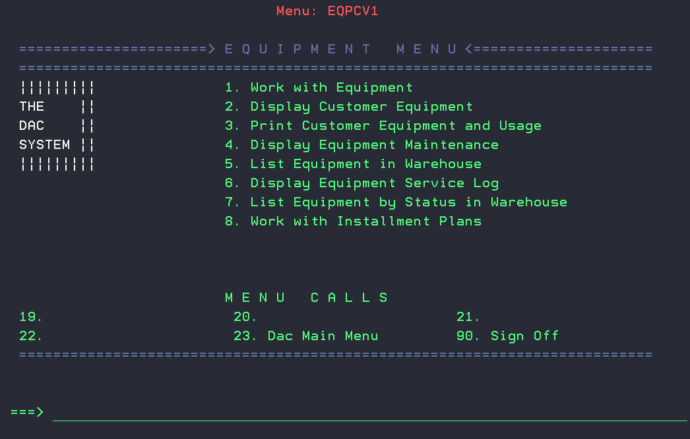
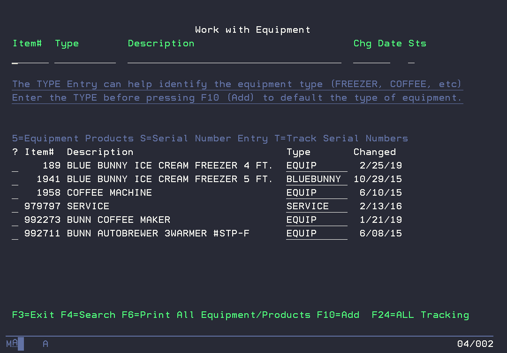

# DAC Equipment Manager
This module enables distributors to track the life cycle of convenience store equipment by serial number. It provides an audit trail for the status and location of each piece of equipment as it moves from warehouse to retailer and back for repairs. DAC Equipment Manager also provides the ability to associate products used by the equipment, such as coffee and condiments for a coffee machine, to determine if the retailer is buying the proper level of products.

## DAC Equipment Menu
10, 19, 9.

## Work with Equipment   
 
 
 **Identify your equipment** items using option 1 from the Equipment Menu. This menu is accessed by taking options 10 then 19 and then 9 starting from the main DAC menu. You will press F10 to add an equipment item into the list of equipment available to DAC Equipment Manager. Tip: Use the Type field so you can easily filter the list later by equipment types (e.g. FREEZER, COFFEE, etc). 

### Equipment Products
You can identify your products used by each equipment item using option 5 *Work with Equipment Products*. Associating products (items) used by the equipment will help DAC Equipment Manager keep you informed about product sales that the equipment is generating for your company

### Serial Number Entry
 Enter serial numbers in use for each equipment item. There are multiple places to record serial number activity. We will focus first on doing that directly from the Equipment menu since that method is most useful if you are entering information from your existing manual information. Inside option 1 from the Equipment menu if you place an “S” beside an equipment item you can identify that a particular serial number related to that item is being received for the first time, placed at a store, returned from a store, needs repair, or is available again after being repaired. The customer number entry is only needed for placement or return. 

You will be prompted to enter the serial number twice. The two entries must be identical. We do this to catch a keying mistake. If you fail to make matching entries twice in a row you will be returned to the place you started. 

### Track Serial Numbers
 Work with Equipment Tracking, "T" on an item will show you the history of the items location and status:
- R = received
- P = Placed in store
- C = Returned from store
- N = Repair
- A = Available
- X = Refurbished

## Display Customer Equipment
 Display customer equipment option 2 from the DAC Equipment menu will show you the log of equipment and its status tied to the customer. The F1 function key can be used to display current equipment in the store.

## Print Customer Equipment and Usage  
Print Equipment option 3 can be used for printing analysis reports or creating CSV files.
- F6 Print w/Sales
  - Date range is required
  - By Base or Net profit
  - DMQBPFR$
- F8 Print only equipment in store DMROPFR$
- F18 Print ALL Equipment by status DPI4PFR$

## Display Equipment Maintenance     
Display Equipment Maintenance option 4 provides history of the service records for each serial number. This is for helping keep track of maintenance records as well as upcoming maintenance or retiring of the equipment.

## List Equipment in Warehouse    
The List Equipment in Warehouse report option 5, DMTVPFR$, provides a list of all warehouse equipment, description, Status, as well as serial numbers for all equipment that is in the warehouse. 

## Display Equipment Service Log     
Display Equipment Service Log option 6 is used for tracking service details on equipment. This logs a general description, Who, where, as well as information on the mileage/service rate and time tracking. 

The service records can be printed at serial number, employee id, or by date range. DMYOPFR$

## List Equipment by Status in Warehouse
This report, DPD4PFR$, is used to provide information regarding equipment that is in the warehouse by status code.

## Work with Installment Plans   
This optional, low cost- one time setup, stand alone module allows you to bill customers in recurring installments (Weekly or Monthly) for specific charges.

### Creating an installment Charge Item
First create a new non-inventory charge item with the correct Category and Sales Class for your financials. The dollar value will need to be set to .001 (This value is calculated later).

### Job Scheduled Job
The Installment charge item will need to be defined in System Option IPP001.

3 job scheduled entries will need to be created. 
  - Weekly- IPBILLINGW- CALL PGM(HWKCXFR) PARM(' ' 'W')
  - Monthly- IPBILLINGM- CALL PGM(HWKCXFR) PARM(' ' 'M')
  - Yearly  - Weekly- IPBILLINGW- CALL PGM(HWKCXFR) PARM(' ' 'Y')

### Creating Installment Plan
Now that the Installment Plan item has been created, defined as the installment item, and configured for weekly/monthly billing in job scheduled entry, we  can create an installment plan with F10.

First select which customer this plan is for. The IP Description becomes the item description for the charge on the customers' invoice. Next define the original amount and number of payments. Now you can provide the beginning date and billing interval (Weekly, Monthly, Yearly). Type is used for filtering or categorizing additional installment plans. 

Now you should have a new installment plan created, the payment schedule has been setup. You can now use option 5, View Details, to view the installments as well as status of previous or future payments. 

From the Display Installment Plan menu, function F6 can be used for printing the installment plan information based on status, interval, customer, and even amount. HWKDPFR$

# FAQ and Common Issues
- Equipment products can be created by classes, this may continually add products that have since been removed. Example- Item 085766 Coffee maker is including items in Prod Class 35. Item 233654 has been removed, but since its in Product Class 35, and Product Class 35 was used to add this item, Item 233654 will return with EOD. 

- running the installment plan job scheduled entry will force a remote order out for the installment plan.

