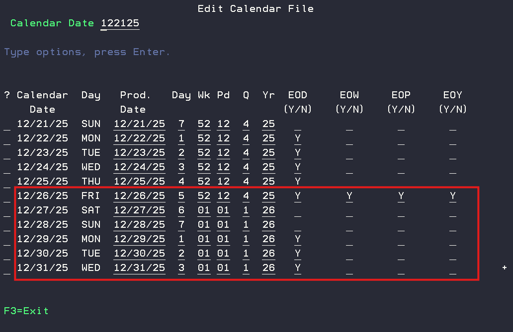

#  DAC Calendar Reminder

This guide outlines the steps required to create the new calendar year and verify its accuracy in DAC. It also includes notes on managing special occurrences such as Week 53 overlapping into the new year and adding and removing closes for holidays.

## Calendar Records
Calendar records are created one year at a time and must exist before closing the current year. If you are on a fiscal year, this may have already been completed. DAC Calendar users are expected to create a new calendar for the 2026 year. 

## Verify Current Calendar Format
Before creating the new year’s calendar, confirm that the format is correct for EOD (End of Day) and EOW (End of Week) processes.

**Steps:**

Navigate to menu options: 1, 4, 9

Confirm the correct days are marked for when you wish to run EOD and EOW. The example below shows EOD will be ran on Monday - Thursday, and EOW will run on Friday. If changes need to be made, please create a [support ticket](https://friedmancorp.itclientportal.com/ClientPortal/Login.aspx). 

If you operate a day ahead, ensure a “Y” appears on this screen.

## Create New Calendar Year
Once the current calendar format is confirmed you can generate the new year. 

1. Navigate to menu options: 1, 4, 9. 
2. Enter the year to be created in the "Create Calendar Records For Year".
3. Enter a date for the "Specify The Date That Week 1 Will begin on".
4. Press F10 to generate the new calendar record. 

## Validating Calendar records
After adding the calendar records for an upcoming year, the Edit Calendar File application is used to make any necessary changes to the closing dates, and designate on which dates closing procedures will be executed. Please review your holiday dates and update the closing records accordingly. 

1. Review the calendar close dates from 1, 4, 10
2. Restrict the view to the new year- (010126 for Jan 1, 2026).
3. Page through the entire year and confirm:
    - EOD, EOW, EOP, EOY values are correct for Holidays and closures. 
    - There is no unintended week 53.

## <B> Troubleshooting </B>

### <B> Week 53:</B>
Cumulative sales reports only account for 52 weeks. It is recommended that you update your calendar's 53rd week so that you include the days falling into week 53 into week 52 and running EOY on 12/26/25 along with your EOD/EOW/EOP.

Below is an example of a week 53 being updated so that week 53 is included into week 1. 

### <B> Calendar was created incorectly </B>
If the days of the week were incorectly entered, you can remove the new calendar file from the menu options:
1, 4, 9, F11 to delete calendar records

### <B> Reviewing Closing Control Display </B>
You can review the current closing control file for reviewing your current production date through menu options 1, 4, 2, type "CURRENT" as the key, then press ENTER.

