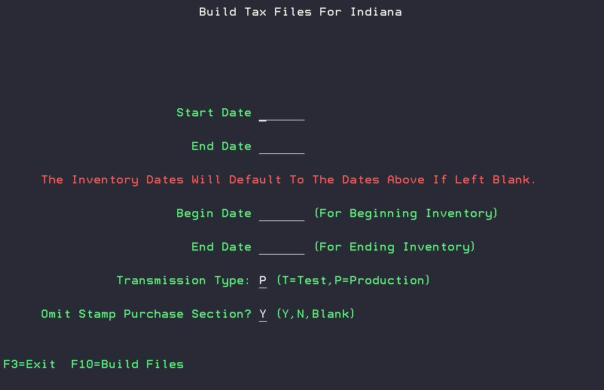
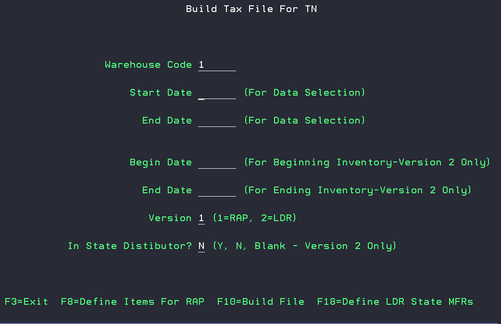

# DAC State Tax Reporting Modules

|       |                           |
| ----------- | ------------------------------------ |
| [Alabama Tax Reporting](#alabama-tax-reporting)      | [New York Tax Reporting](#new-york-tax-reporting)       |
| [Arkansas Tax Reporting](#arkansas-tax-reporting)      | [Ohio Tax Reporting](#ohio-tax-reporting) |
| [Florida Tax Reporting](#florida-tax-reporting)    | [Oklahoma Tax Reporting](#oklahoma-tax-reporting) |
| [Georgia Tax Reporting](#georgia-tax-reporting)  | [Oregon Tax Reporting](#oregon-tax-reporting) |
| [Iowa PACT ACT Tax Reporting](#iowa-pact-act-tax-reporting) | [Pennsylvania Tax Reporting](#pennsylvania-tax-report) |
| [Illinois Tax Reporting](#illinois-cigarette-tax-reporting) | [Tennessee Tax Reporting](#tennessee-tax-reporting) |
| [Indiana Tax Reporting](#indiana-tax-reporting) | [Texas Tax Reporting](#texas-tax-reporting) |
| [Kentucky Tax Reporting](#kentucky-tax-reporting) | [Virginia Pact ACT Tax Reporting](#virginia-pact-act-tax-reporting) |
| [Louisiana Tax Reporting](#louisiana-tax-reporting) | [Washington Tax Reporting](#washington-tax-reporting) |
| [Michigan Tax Reporting](#michigan-tax-reporting) | [Wisconsin Tax Reporting](#wisconsin-tax-reporting) |
| [Missouri PACT ACT Tax Reporting](#missouri-pact-act-tax-reporting) | |

## Alabama Tax Reporting

The following files are created in CV1COM:
    
> AL- Alabma, YY- Year, MM- Month

- Schedule D Participating - ALYYMM.CSV 
- Schedule D Non-Participating - ALYYMMNP.CSV 
- Sales to National Guard - ÅLYYMMP3.CSV 
- Sales to US Government - ALYYMMP4.CSV 
- Sales to Indian Reservations - ALYYMMP5.CSV 
- AL Tobacco Sales for Resale - ALYYMMTI.CSV 

The Alabama Tax Reporting reports can be generated from Build AL Tax File option in the State Tax Reporing Menu accessible from 6, 7, 22, 6.

Customers can be excluded from the Alabama Resale Format using F8.

### Setup
- [ ] Setup vendor group for Non-Participating Vendors to mark as non-participating. 5, 11.
- [ ] Identify Tax classes that are RYO Tobacco Items. 1, 2, 7. 
- [ ] RYO items need to have ounces defined in UM1 field on those items. 1, 2, 1.
- [ ] Brand names will need to be defined or first 10 characters of the item description will be used. Brand codes can be added to an item from 1, 2, 1, and 2 to edit item, F24- Edit Item Extension. Brand codes can be created using F4 in the BRAND field, and then using F10 to Edit the Brand Master File, and F9 to go to "add" mode. 

## Arkansas Tax Reporting

The following files are created in CV1COM:

>AR-Arkansas, YY- Year, MM- Month

- Cigarette and Tobacco File - AAYYMM.CSV
  
|Information included in report  |  |   |
| ----------- | ------------------------------------ | -------------- |
| Permit Number       | Zip Code       | Product Type |
| Name | Product Description | Tobacco Brand |
| Street Address | Unit | Tobacco Flavor |
| City | Quantity | Tobacco Style |
| State | Invoice Number | Package Quantity |

The Arkansas Tax Reporting reports can be generated from Build AR Tax File option in the State Tax Reporing Menu accessible from 6, 7, 22, 11.

## Florida Tax Reporting
The following files are created in CV1COM:

>FL-Florida, YY- Year, MM- Month
- Single record format - FLYYMMDD.CSV
- Multiple record format - FLYYMM.TXT
> *Version determined by system option*

The Florida Tax Reporting reports can be generated from Build FL Tax File option in the State Tax Reporing Menu accessible from 6, 7, 22, 19, 4.

You can use F8 to add Entity ID's by customer.

## Georgia Tax Reporting

The following files are created in CV1COM:
    
> GA- Georgia, YY- Year, MM- Month
- Cigarette and RYO Tobacco Sales - GAYYMM.CSV

|Information included in report|   |   |
| ------- | ----- | -------------- |
| MFG # | Customer Number | State |
| MFG Name | Customer Name | Invoice Number |
| Brand | Address | Cigarette Sticks |
| Date Sold | City | RYO Units |

The Georgia Tax Reporting reports can be generated from Build GA Tax File option in the State Tax Reporing Menu accessible from 6, 7, 22, 5.

## Iowa PACT ACT Tax Reporting

The Iowa Pact Act Tax file generates 2 files for cigarette and tobacco sales data in the root directory:
- Detail- ################.DTL
- Header- ################.HDR

The Iowa Tax Reporting reports can be generated from Build IA/IL PACT Act File option in the State Tax Reporing Menu accessible from 6, 7, 22, 9.

Additional items can be defined on the report with the F8 option.

## Illinois Cigarette Tax Reporting

The following files are created in CV1COM:
- Illinois Cigarette Data file - ILCIGS.DAT

The Illinois Tax Reporting reports can be generated from Build IL Tax File option in the State Tax Reporing Menu accessible from 6, 7, 22, 4. 

Additional items can be defined on the report with the F8 option.

### Illinois Tobacco Tax Reporting

The following files are created in ILTAX folder:
- Illinois Tobacco Data file - TP-1-IL.CSV

The Illinois Tobacco Tax Reporting reports can be generated from Build Illinois TP-1-IL File option in the State Tax Reporing Menu accessible from 6, 7, 22, 19, 19, 3. You can use F8 to define the tax jurisdiction cross reference.

### Illinois PACT ACT Tax Reporting

The Illinois PACT ACT Tax Report generates 2 files for cigarette sales data in the root directory:
- Detail- ################.DTL
- Header- ################.HDR

The Illinois Tax Reporting reports can be generated from Build IA/IL PACT Act File option in the State Tax Reporing Menu accessible from 6, 7, 22, 9. You will need to update the state field prior to running the report. 

Additional items to report can be added with the F8 option.

## Indiana Tax Reporting
The following files are created for Cigarette and Tobacco in INTAX folder:

- CIGCT19.CSV 
- CIGCT19.XML 
- CIGMTSI.CSV 
- CIGMTS2.CSV 
- CIGMTS3.CSV 
- CIGNRM.XML 
- OTPCT19.CSV 
- OTPCT19.XML 
- OTPMTSI.CSV 
- OTPMTSI.XML

The Indiana Tax Reporting reports can be generated from Build KY Tax File option in the State Tax Reporing Menu accessible from 6, 7, 22, 19, 6.

The first start and end dates are for the data as well as a start and end date for including inventory.
You also have the ability to omit stamp purchases by updating the field to 'N'.

## Kentucky Tax Reporting
The following files are created for Cigarette and Tobacco in the KYTAX folder:
>*These files can be copied to the KDOR_Cigarettes and the KDOR_Tobacco templates*

- Cigarette Inventory Adjustments - CIGINVAJ.CSV & CIGINVAO.CSV 
- Beginning Inventory - CIGINVB.CSV 
- Ending Inventory - CIGINVE.CSV 
- Cigarette Purchases - CIGSAPU.CSV 
- Stamp Purchases - STAMPPUR.CSV 
- Tobacco Purchases -TOBSAPU.CSV 

The Kentucky Tax Reporting reports can be generated from Build KY Tax File option in the State Tax Reporing Menu accessible from 6, 7, 22, 19, 9.

Tax Jurisdiction Cross Refrence can be defined with option F8.

## Louisiana Tax Reporting
The following files are created for Cigarette and Tobacco in the LATAX folder:
>*These files can be copied to the LaTAP_Tobacco_Tax_template file*

- Cigarette and RYO Sales - CIGRYOSA.CSV 
- Cigarette and Tobacco Purchases - CIGTOBPU.CSV 
- Cigarette and Tobacco Credits - CIGTOBCR.CSV 	

The Louisiana Tax Reporting reports can be generated from Build LA Tax File option in the State Tax Reporing Menu accessible from 6, 7, 22, 19, 7.

You have the ability to enter Manufacturer Returns with the F8 option.

## Michigan Tax Reporting
The following files are created for Cigarette and Tobacco in the MITAX folder:

- Cigarette Purchases (Receipts) in Michigan - C101A.CSV 	 
- Cigarette Purchases (Wholesalers or Secondary Wholesalers Only) - C101B.CSV  
- Returned Stamped (Tax-Paid) Cigarettes from Michigan Customers - C101C.CSV  
- Out-of-State Cigarette Shipments (Michigan Based Licensees Exports Only) - C103.CSV   
- Cigarette Sales in Michigan from Tax-Unpaid Inventory - C108B.CSV 
- Cigarette Sales from Tax-Paid Inventory - C108C.CSV 
- Tax-Unpaid Other Tobacco Product Purchases for Michigan (Michigan Based Licensees Only) - T101A.CSV 
- Tax-Paid Other Tobacco Product Purchases (Wholesalers Only) - T101B.CSV 
- Tax-Paid Other Tobacco Product from Michigan Customers - T101C.CSV 
- Out-of-State Other Tobacco Product Shipments (Michigan Based Licensees Exports Only) - T103.CSV   
- Tobacco Product Sales in Michigan from Tax-Unpaid Inventory - T108B.CSV  
- Other Tobacco Product Sales from Tax-Paid Inventory - T108C.CSV  

The Michigan Tax Reporting reports can be generated from Build MI Tax File option in the State Tax Reporing Menu accessible from 6, 7, 22, 19, 2.

The Cigarette or Tobacco files can be generated with the Tax type 'C' for Cigarettes or 'T' for Tobacco.

## Missouri PACT ACT Tax Reporting
The following files are created for Cigarette and Tobacco in the CV1COM folder:

- Cigarettes - MOPACTCG.CSV
- Tobacco- MOPACTTB.CSV

The Missouri PACT ACT Tax Reporting reports can be generated from Build MO PACT ACT File option in the State Tax Reporing Menu accessible from 6, 7, 22, 19, 3.

## New York Tax Reporting 
A single file is created for Cigarette and Tobacco sales in the CV1COM folder:

- NYDATA.TXT

The New York Tax Reporting reports can be generated from Build NY Tax File option in the State Tax Reporing Menu accessible from 6, 7, 22, 3.

## Ohio Tax Reporting 

### Tax Reporting

The following files are created for Cigarette and Tobacco Sales and Purchases in the OHTAX folder:

- CIGS##########WH1.TXT
- OTP#########.TXT

The Ohio Tax Reporting reports can be generated from Build OH Tax File option in the State Tax Reporing Menu accessible from 6, 7, 22, 19, 2.

You have the ability to enter Manufacturer Returns with the F8 option.

Out-of-state Tax Reporting files will generate when using the 'N' option for the "In State Distributor" field.

### Out Of State Cigarette Sales Reporting 

The following files are created for Cigarette and Tobacco Sales and Purchases in the DACEMAIL folder:
> XX = State Abbreviation

- XXCIGSLS.CSV

The Ohio Out of State Cigarette Sales Reporting reports can be generated from Build OH Out of State Cigarette Sales option in the State Tax Reporing Menu accessible from 6, 7, 22, 19, 19, 2.

## Oklahoma Tax Reporting

The following files are created for Cigarette and RYO Tobacco Sales in the CV1COM folder:

> OK-Oklahoma, YY- Year, MM- Month

- OKYYMM.CSV

The Oklahoma Tax Reporting reports can be generated from Build OK Tax File option in the State Tax Reporing Menu accessible from 6, 7, 22, 10.

Out-of-state Tax Reporting files will generate when using the 'N' option for the "In State Distributor" field.

## Oregon Tax Reporting
The following files are created for Tobacco Sales and Purchase in the DACEMAIL folder:

>*The .PDF files are automatically emailed*

- ORSCH1A.CSV 
- ORSCH1A.PDF   
- ORSCH2A.PDF  
- ORSCH3A.PDF  
- ORSCH4A.PDF  
- ORSCH5A.PDF  
- ORSCH6A.PDF  
- ORSCH7A.PDF  
- ORSCH8A.PDF 

The Oregon Tax Reporting reports can be generated from Build OR Tax File option in the State Tax Reporing Menu accessible from 6, 7, 22, 19, 8.

## Pennsylvania Tax Report

The following files are created for Cigarette and Tobacco Sales and Returns in the PATAX folder:

- DAS-95.CSV  -  Details For DAS-95               
- REV1042E.CSV - In State ECIGS-Distributors      
- REV1042R.CSV - In State RYO-Distributors        
- REV1042S.CSV - In State Smokeless-Distributors  
- REV1142.CSV -  Unstampable LittleCigars In PA   
- REV1163.CSV -  Cigarette Sales Into PA-PACT ACT 
- REV1164.CSV -  Tobacco Sales Into PA-PACT ACT     
- REV1808.CSV -  In State RYO Sales-NPM             
- REV1808D.CSV - Details For In State RYO Sales-NPM 
- REV679A.CSV -  In State Smokeless-Retailers       
- REV679B.CSV -  In State RYO-Retailers             
- REV679C.CSV -  In State ECIGS-Retailers           
- REV679DE.CSV - Out Of State ECIGS-All Custs       
- REV679DR.CSV - Out Of State RYO-All Custs 
- REV679DS.CSV - Out Of State Smokeless-All Custs   
- REV679EE.CSV - Products Returned To MFR-ECIGS     
- REV679ER.CSV - Products Returned To MFR-RYO       
- REV679ES.CSV - Products Returned To MFR-Smokeless

The Pennsylvania Tax Reporting reports can be generated from Build PA Tax File option in the State Tax Reporing Menu accessible from 6, 7, 22, 19, 1.

You have the ability to add vendors to the DAS-95 file with the F8 option.

### PA Consolidated Cigarette Files

The following files are created for Cigarette and Tobacco Sales and Returns in the PATAX folder:

- CIGCONS.CSV
- CIGINV.CSV

The Pennsylvania Consolidated Cigarette Files can be generated from Build PA Consolidated Cigarette Files option in the State Tax Reporing Menu accessible from 6, 7, 22, 19, 19, 1.

You have the option to enter Manufacturer Returns to the file with the F7 option.

## Tennessee Tax Reporting 
### Tennessee LDR Tax Reporting

A single file is created for the LDR Report in the CV1COM folder:

- TNLDRV2.CSV

The Tennesse LDR Tax Reporting files can be generated from Build TN Tax File option in the State Tax Reporing Menu accessible from 6, 7, 22, 7.

>*Version 2- LDR must be selected for creating the LDR version of the files.*

Out-of-state Tax Reporting files will generate when using the 'N' option for the "In State Distributor" field.

You have the ability to Define LDR State Manufacturers with the F18 option.

### Tennessee RAP Tax Reporting

A single file is created for the RAP Report in the CV1COM folder:

- TNTAXF.CSV

The Tennesse RAP Tax Reporting files can be generated from Build TN Tax File option in the State Tax Reporing Menu accessible from 6, 7, 22, 7.

>*Version 1- RAP must be selected for creating the RAP version of the files.*

Out-of-state Tax Reporting files will generate when using the 'N' option for the "In State Distributor" field.

You have the ability to Define Items for RAP with the F8 option.

Once the TN Reporting module is activated (8n, 3: TN Reporting Active = 1), You will need to define the Distributor ID for TN in SYS054: Distributor ID for TN. 

Setup TN Items for RAP reporting from 6, 7, 22, 7, F8.

Setup NACS Categories from 10, 2, 9, Work with NACS Categories. 

### Tennessee PACT ACT Reporting

A single file is created for the Tennessee Pact Act in the CV1COM folder:

- TNPACTV2.CSV

The Tennesse PACT ACT Reporting files can be generated from Build TN Tax File option in the State Tax Reporing Menu accessible from 6, 7, 22, 8.

## Texas Tax Reporting 
A single file is created for Cigarette and Tobacco Sales in the CV1COM folder:

- TXTAXF.DAT

The Texas Tax Reporting files can be generated from Build TX Tax File option in the State Tax Reporing Menu accessible from 6, 7, 22, 1.

You have the ability to Edit Non-participating Vendors with the F9 option.

## Virginia PACT ACT Tax Reporting 

The Viginia PACT ACT Tax Report is a single printed report with the filename:

- HWM7PFR$

The Viginia PACT ACT Tax Report can be generated from Print VA PACT Act Report option in the State Tax Reporing Menu accessible from 6, 7, 22, 19, 11.

## Washington Tax Reporting 

The following files are created for Cigarette and Tobacco Sales in the WATAX folder:

- Cigarettes - WACIG.CSV
- RYO - WARYO.CSV
- Smokeless - WASMKLES.CSV

The Washington Tax Reporting reports can be generated from Build WA Tax File option in the State Tax Reporing Menu accessible from 6, 7, 22, 19, 10.

Out-of-state Tax Reporting files will generate when using the 'N' option for the "In State Distributor" field.

## Wisconsin Tax Reporting 
The following files are created for Cigarette and Tobacco Sales in the WITAX folder:

- Cigarettes - CIGMMYY.CSV
- Tobacco - TOBMMYY.CSV

The Wisconsin Tax Reporting reports can be generated from Build WI Tax File option in the State Tax Reporing Menu accessible from 6, 7, 22, 19, 5.

Out-of-state Tax Reporting files will generate when using the 'N' option for the "In State Distributor" field.

You have the ability to Edit Vendor Info with the F8 option.
You can edit the vendor name with option F18.

