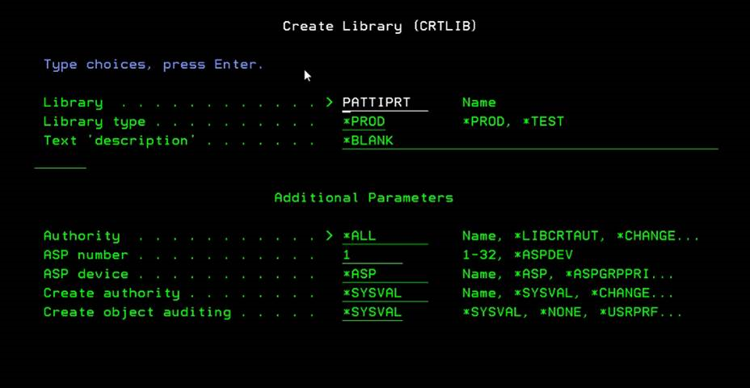
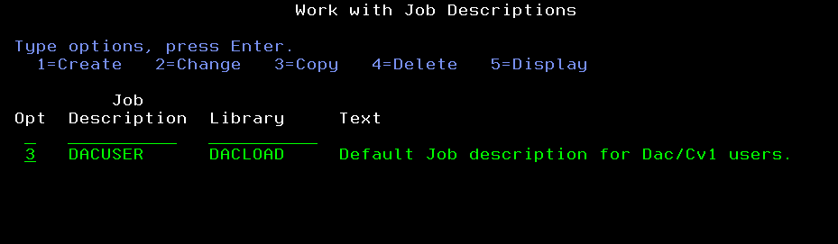
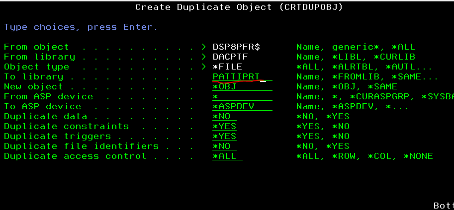
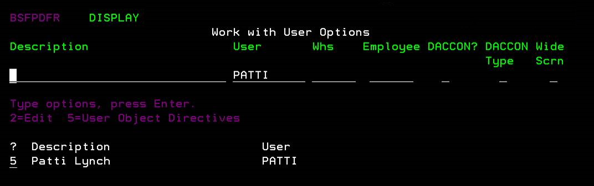

# Zen and the art of Print Files
## Heirarchy of print files
The printer heirarchy is used to determine which output queue or printer will be used when generating a new spooled file. This allows complex "if this, than this" print structures where certain configurations will override the default print settings. 

Printer File Queue > Job Description Queue > User Profile Queue> Workstation Queue > Printer File device > Job description printer device > User Profile device > Workstation device > Default Printer set up in sysval

 [Refrence](https://www.ibm.com/support/pages/determining-print-hierarchy-parameters)


## Printer devices
### How to create a print device
1.  In IBM Navigator for i, expand Basic Operations > All Tasks > Printers.
2.  Click Add Printer.  
The Add Printer wizard then starts. Follow the instructions in the wizard to add your printer. Please reach out to your system administrator for troubleshooting or contact IBM for troubleshooting at 1-800-IBM-SERVE.

## Changing Print Files
### Using CHGPRTF
The Change Printer File (CHGPRTF) command changes the attributes of the specified printer device file. It is recommended to use User Object Directives as the CHGPRTF command could be overwritten by a PTF or update. The CHGPRTF is not permanent. The CHGPRTF command allows you to save, hold, print multiple copies and more-https://www.ibm.com/docs/en/i/7.4?topic=ssw_ibm_i_74/cl/chgprtf.html

### Using User Object Directives
User Object Directives allows for persistent print file customizations after updates, PTF's, or system upgrades and should be used instead of the CHGPRTF command. UOD can be accessed from the DAC Main Menu, 1, 4, 7, F8.

  

#### Adding a print object in User Object Directives
If you would like to create a custom print file rules for an object that does not exist, you can use the F10 option to add a new object. *PTF should be used as the user ID to ensure it is ran after a ptf update or DAC upgrade.

After selecting the User ID *PTF and entering the object to be changed, you will use the command CHGPRTF in the DIRECTIVE field and press F4 to prompt. This will present you with the print file options for the specific report. 
  

Pressing F4 on the line.

  

From here you can make necessary changes to the print file- Save, Hold, Change default printer, multiple copies, etc.

#### Editing a print object in User Object Directives
If you would like to change how a current print file is configured you will need to navigate to User Object Directives 1, 4, 7, F8. From here you will need to search or filter for the print file object including the trailing $ in the print object name. Many of these objects can be found in the top left corner of the report. 


## FAQ
### Replacing a printer
When replacing a printer, the same make and model or comparative should be used so that the print drivers in the device description are compatible with the new printer. You will need to reach out to the printer manufacturer or IBM if you need to install a new print driver. Many drivers can be automatically installed when using the Print Wizard in Navigator for I. 

1. Note the IP address of the current printer being replaced. This IP address will need to be assaigned to the new printer.
2. End the writer using the ENDWTR command. 
3. Vary off the printer with the VRYCFG command.
4. Replace the old printer with the new printer.
5. Vary on the printer with the VRYCFG command
6. Start the writer using STRPRTWTR command. 
7. Check WRKWTR or WRKACTJOB for any messages related to

### Restarting a printer
Here are the commands you’ll need to restart a printer using "PRT05" as an example. Please adjust the command using your device description as needed for the printer in question. Each bold line must be entered by itself. 
```
ENDWTR PRT05 OPTION(*IMMED)  
```
```
VRYCFG PRT05 *DEV *OFF
```
Turn off physical printer  
Wait 30 seconds            
Turn on physical printer   
``` 
VRYCFG PRT05 *DEV *ON       
```
```
STRPRTWTR PRT05           
```

### Set a specific print file for a specific user
User Patti wants their print object DSUFPFR$ to go to their printer P2 while everyone else still prints to P1.

1. Create a new library for the user to store their print files in
  a. Use the command CRTLIB to create a new library for that users print files example: PATTIPRT
  

2. Create a new job description for the user profile to use.  
 
    a. Use WRKUSRPRF and note the current Job description and library. 
    
    
    b. Once noted use the command WRKJOBD JOBD(DACUSER), use the option 3 to make a copy of the Job Description for the new user. 
    
    
    c. The copy should be named referencing the user- DACUSERPAT 
    

3. Now use this new job description you created in the user's profile. WRKUSRPRF and update Patti's job description to DACUSERPAT
		
    

4. Now we need to copy the print file to the new library that was created that the new job description will be using.  
  
    a. Use WRKOBJ *all/DSP8PFR$.  
        
    
    b. Use a 3 to copy that object in your users LIBRARY from step 1 (PATTIPRT).
		

5. Now that Patti has her own print file, we need to change where that print file goes. Use User Object Directives to make the change 1, 4, 7.  
  
    a. Use a 5 next to the user.
	
  
    b. Make the changes to the printfile- change printer, set to hold, save, etc.
	
  
    c. Use an X  to execute the changes.
	
	
