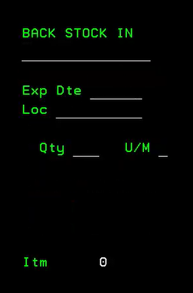
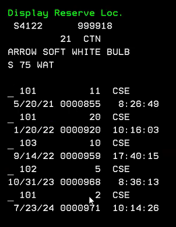
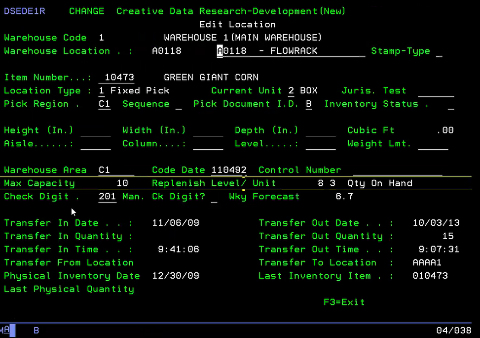

# Warehouse Management- Put Away process:
Getting product from receiving dock to the shelves. Setting up replenishment and how its generated along with general warehouse management.

## Stock Put Away Process
2, 1- Stock Put Away process.

  

**Receiving Stock:** After receiving, print put away labels to aid in directing the put away process.

**Scanning:** Scan the UPC and the location where the product will be placed. Enter the quantity. You can limit how many are put away at the location as well as pressing F1 for backstock

**Indicators:** "PICK SLOT" If no product is in the pick slot, the system will direct you to place it there first. If there are items in backstock, you will not get a notification to not interfere with stock rotation. Replenishment will tell you to move items from backstock to the current pick location.

"Date < Today"- If expiration date is older than todays date. 

**Stock Transfer** Manually moving product around the warehouse. Scan UPC and the system will tell you where the oldest product is in the warehouse. You can use F5 from this menu to also see all the locations for the items in the warehouse (Display Reserve Loc). Using a 2 will allow you to edit quantities at the location. 

## Managing Back Stock

**Editing Locations:** Use the system (2 to edit) quantities and move products between back stock locations with Display Reserve Location.

**Monitoring:** Supervisors can monitor warehouse activities and correct any discrepancies.

## Replenishment Process

**Setting Up:** Define min and max levels for each location- 1 2 2 Work with Locations. You want to define the Max Capacity at the buying level which is typicaly 3- Cases. QTy on hand is tied to the QM at the selling unit. 

Daily average tracking- determines how many are picked on a certain day. This can trigger a replenishment based on daily movement. Picking can trigger a critical replenishment which shows in the replenishment menu.

**Generating Replenishments:** The system can generate replenishments based on min/max levels, daily averages, and critical needs during picking. 

**Manual Replenishment:** Supervisors can manually generate replenishment requests as needed. 4, 3, 4

## Replenishment Execution
Two Methods:
Two-Person Process: Forklift driver retrieves items and places them for the put away person. Let Down Backstock- shows forklift driver where to get product. Driver can select order- 
    
    Backstock sequence- order of locations
    
    Reverse pick slot- building a pallet backwards to be easier for replenishment. 

Single-Person Process: Picker retrieves items directly from back stock to the pick slot.

## Monitoring and Reporting

**Warehouse Inventory Moves:** Track all warehouse activities and correct any issues. Select Moves, Putaways, Pending, Etc.

**Stock Report:** 4, 3, 5, F8. Run reports to see the work done by each operator by date.

**Received Not Put Away:** 4, 3, 5, F6. Monitor items received but not yet put away to identify and correct mistakes.

## FAQ

You can identify products as date sensitive to combined products with similar expiration dates as opposed to first in first out. Items marked date sensitive will prompt the receiver for a EXPIRATION DATE. This will override the backstock location if the product is older.

You can use Display Reserve Location to make edits to the backstock qty. This does not change the qty on hand. This only effects location qty. 

Weekly forecast average in Edit Location comes from purchasing to give an idea of how many are moved in a week.  Week worth of picks in a location.

If replenishment request are not completed, they will need to be removed from Work With Replenishment as they will rebuild from the night before.

