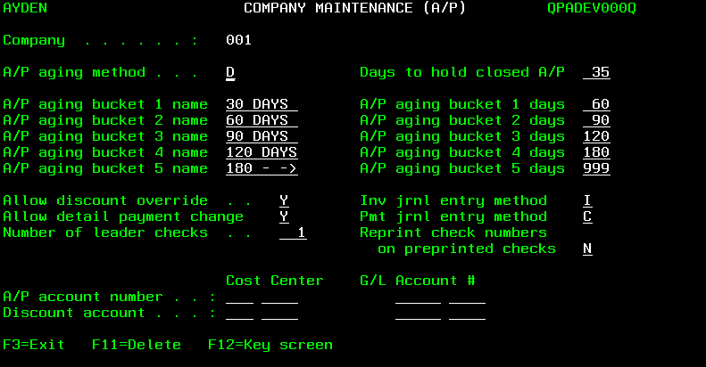

# Accounts Payable

Before “getting started” with DAC Accounts Payable (A/P) System, users should refer to the [Introduction of the Getting Started](getting-started.md/#introduction) document for information about DAC data, screens and menus.

After selecting option 11 (Accounts Payable) of the DAC Main Operations Menu screen, the Accounts Payable screen appears.

Users can press &lt;F3&gt; to redisplay the Main Operations Menu screen.

Refer to the [Accounts Payable Quick Reference Guide](./../quick-refrence-guide/Accounts%20Payable%20QRG.md) for an overview of the use of the Accounts Payable System.

For information about transferring purchase orders to Accounts Payable, and the report which is printed when transfers occur, refer to [Transferring Purchase Orders To Accounts Payable](purchasing.md/#transferring-purchase-orders-to-accounts-payable) of the Purchasing document.

## Getting started with Accounts Payable

The steps below are followed to create the necessary records before the Accounts Payable System is used. If the DAC General Ledger System is used (or only the General Ledger account numbers are used), the steps below must not be taken until:

- The cost center number(s) and General Ledger account numbers are defined. Refer to the [General Ledger](<General Ledger.md>)document for information about using the G/L File Maintenance applications to add cost center and G/L account records.

- The cost center number(s) and General Ledger account numbers are combined using the Work With Cost Center application.

    >Note: The General Ledger System is used by selecting option 22 (General Ledger) of the Accounts Payable screen, or by selecting option 12 (General Ledger) of the DAC Main Operations Menu screen.

**Step 1**: Use the Work With System Options application to make any necessary changes to the value of the default system option record fields related to Accounts Payable. Refer to the [DAC Default System Options](<DAC Default System Options.md>) document for information about the A/P Interface Active? and A/P Terms Positions Used fields of the SYS005 default system option, and the Accounts Payable Active? field of the SYS015 default system option.

**Step 2**: Use the Company Maintenance screens to add preliminary data, such as name and address, of the company. Multiple companies must be set up if users track retained earnings or net profit and loss for more than one entity, such as multiple warehouses or divisions. Refer to [Working With Company Records](#working-with-company-records) for additional information.
    
>Note: This step is not necessary if the company records were previously added using the General Ledger System.

**Step 3**: Use the User Profile Maintenance screen to designate the names of A/P users, and with which company each user works. Refer to [Working With User Profile Records](#working-with-user-profile-records) for additional information. 
>Note: This step is not necessary if the user profile records were previously added using the General Ledger System.

**Step 4**: Sign off the DAC system, then sign back on.

**Step 5**: Use the Company Maintenance (A/P) screen to add company A/P data, such as the aging method used by a company. Refer to [Working With Company A/P Options](#working-with-company-ap-options) for additional information.

**Step 6**: Use the Company Maintenance (G/L) screen to add company G/L data if General Ledger account numbers are used. Refer to [Working With Company G/L Options](#working-with-company-gl-options) for additional information.
>Note: This step is not necessary if the company G/L options were previously added using the General Ledger System.

**Step 7**: Use the Period Date Maintenance screen to add period date data. Refer to [Working With Period Date Records](#working-with-period-date-records) for additional information.
>Note: This step is not necessary if the period date records were previously added using the General Ledger System

**Step 8**: Use the Period Date Inquiry screen to verify the starting and ending dates of the periods (also referred to as months) of the user’s fiscal year. Refer to [Displaying Period Date Records](#displaying-period-date-records) for additional information.

**Step 9**: Use the Period Status Inquiry screen to verify the A/P open status for the periods of the user’s fiscal year. Refer to [Displaying Period Status Records](#displaying-period-status-records) for additional information.

**Step 10**: Contact CDR support personnel who will assist users with the execution of the Company A/P One Time Maintenance application.

**Step 11**: Use the Bank Maintenance screen to add bank data. Refer to [Working With Bank Records](#working-with-bank-records) for additional information.

**Step 12**: Use the Vendor Terms Maintenance screen to add terms data. Refer to [Working With Terms Records](#working-with-terms-records) for additional information.

**Step 13**: Use the Vendor Maintenance screen to add vendor data. Refer to [Working With Vendor Records](#working-with-vendor-records) for additional information.

**Step 14**: Use the Item Maintenance screen to add A/P item data. Refer to [Working With A/P Item Records](#working-with-ap-item-records) for additional information.

**Step 15**: Use the Work With A/P Options screen to designate various defaults (company, terms, bank and pay date) and A/P related options. Refer to [Working With A/P Options](#working-with-ap-options) for additional information.

**Step 16**: Use the Vendor Maintenance screen to add data concerning recurring payments. Refer to [Working With Recurring Invoice Records](#working-with-recurring-invoice-records) for additional information.
>Note: The Special Item application (option 4 of the A/P File Maintenance screen) and Entity application (option 10 of the A/P File Maintenance screen) are no longer used due to system upgrades.

Refer to the [Accounts Payable Quick Reference Guide](<../quick-refrence-guide/Accounts Payable QRG.md>) for an overview of the use of the Accounts Payable System

## Accounts Payable and General Ledger Account Numbers

If the DAC [General Ledger](<General Ledger.md>) (G/L) System is used, credit and debit journal entries are created when invoice batches are posted and payments are processed.

### Posting invoice batches

The General Ledger account number which is credited when invoice batches are posted is designated by the A/P account number field (see below) of the company A/P options

The various G/L account numbers which are debited when invoice batches are posted are designated by a user-named field (see below) of the A/P item records. Refer to [Working With A/P Item Records](#working-with-ap-item-records) for additional information

>Note: The specific name of this A/P item record field is designated by the value of the **Account header** field (see below) of a company’s G/L options. Refer to [Working With Company G/L Options](#working-with-company-gl-options) for additional information.

When invoice batches are posted, a single debit journal entry is created in G/L for each detail line of an invoice.
Refer to [Working With Company A/P Options](#working-with-company-ap-options) for information about the:

- **Inv jrnl entry method** field which is used to designate if a single credit journal entry is created for each invoice of a batch, or for the entire batch.

- Dates used for debit and credit journal entries when posting invoice batches.

### Processing Payments

Payment processing includes:

- Using the Print Checks application to print checks for a payment batch.
- Using the Process Manual Payments application to enter data concerning payments made with hand-written checks.
- Using the Process EFT Payments application to enter data concerning payments made with electronic funds transfers (EFTs).

The General Ledger account number which is debited when payments are processed is designated by the A/P account number field (see below) of the company A/P options.

Refer to [Working With Company A/P Options](#working-with-company-ap-options) for additional information. The G/L account numbers which are credited when payments are processed (also referred to as the cash account number and the discount number) are designated by the following fields:

- **Cost Center** and **G/L Account** # fields (see below) of the bank records. Refer to [Working With Bank Records](#working-with-bank-records) for additional information.

    

>Note: The specific names of these bank record fields are designated by the values of the Cost cntr hdr and Account header fields of a company’s G/L options (as described above)

- **Discount account** field (see below) of the company A/P options.

    
Refer to [Working With Company A/P Options](#working-with-ap-options) for additional information.

When payments are processed, a single credit journal entry is created in G/L (for both the cash account number and the discount number) for each individual payment (printed check, manually-written check and EFT transaction).

Refer to [Working With Company A/P Options](#working-with-ap-options) for information about the:

- **Pmt jrnl entry method** field which is used to designate if a single debit journal entry is created for each payment of a batch, or for the entire batch when printing checks.
    >Note: A single debit journal entry is created for each manual check and each EFT processed.

- Dates used for debit and credit journal entries when processing payments.

## Working with Accounts Payable File Maintenance

The Accounts Payable File Maintenance applications are used to create:

|  |  |
| :---: | :---: |
| **Company Records**   | **Terms Records** |
| **User Profile Records**   | **Vebdor Records**|
| **Company A/P Options**  | **A/P Item Records** |
| **Company G/L Options**  | **A/P Options** |
| **Period Date Records**  | **Recurring Invoices Records**|
| **Bank Records**|  |
| | |

After selecting option 11 from the Main Operations Menu screen, the Accounts Payable screen appears.

After selecting option 20 (A/P File Maint.) from the Accounts Payable screen, the A/P File Maintenance screen appears.

## Working With Company Records

The Company Maintenance screen is used to add at least one company record before the Accounts Payable System is used. Multiple companies must be set up if users track retained earnings or net profit and loss for more than one entity, such as multiple warehouses or divisions. Refer to [Working With Company G/L Options](#working-with-company-gl-options) for additional information.

1. Select option 7 (Company) from the A/P File Maintenance screen. The Company Maintenance (Change) screen appears.

    

2. If necessary, enter ? for the **Company** (3,a) field and press &lt;Enter&gt; to display a list of the previously added company records on the Company Selection screen.If desired, 1 (Select Request) can be entered in the selection column to display, edit or delete a company record, or the user can press &lt;F3&gt; to display the Company Maintenance (Add) screen.

3. If necessary, press &lt;F9&gt; (Go to 'Add' mode) to display the Company Maintenance (Add) screen.

4. To add a new company record, enter a company code for the **Company** (3,a) field.

5. Press &lt;Enter&gt;. The Company Maintenance screen is redisplayed.

6. Enter data for the following fields:
    - **Name** (40,a) - the name of the company.
    - **Address line 1** (30,a) - the company’s street number and street name, or post office box number.
    - Optional: **Address line 2** (30,a) - remaining portion of the company’s address, such as post office box number if not entered for Address Line 1.
    - **City** (20,a) - the city of the company’s mailing address.
    - **State** (2,a) - the state of the company’s mailing address.
    - **Postal code** (5-9,n) - the zip code and 4-digit extension of the company’s mailing address.
    - Optional: **Phone number** (10,n) - the company’s area code and telephone number.
    - Optional: **Fax number** (10,n) - the company’s area code and telephone number for fax transmission

7. Enter Y (yes) for the **G/L interface** (1,a) field to designate that Accounts Payable data is transferred automatically to General Ledger. If the DAC General Ledger System is not used, enter N (no).
    > Note: If the General Ledger System is not used, but chart of account numbers that are created using the General Ledger System are used, Y must be entered for the **G/L interface** field.

8. Press &lt;Enter&gt; when prompted to confirm. The Record added message appears at the bottom of the Company Maintenance screen.

9. Press &lt;F3&gt; to exit. The A/P File Maintenance screen appears.
Refer to Working With General Ledger Reports of the General Ledger document for information about printing a complete list of companies.

## Working With User Profile Records

After company records are added, the User Profile Maintenance screen is used to add user profile records which designate the company with which each user works. The designated company will be automatically selected when a user signs on.

Refer to [Selecting An Alternative Company](#selecting-an-alternative-company) for information about using the Select Alternative Company application to work with a different company.

Refer to [Selecting The Default Company](#selecting-the-default-company) for information about using the Select Default Company application to resume working with the default company when work with an alternative company is complete.

1. Select option 11 (User Profile) from the A/P File Maintenance screen. The User Profile Maintenance (Add) screen appears without values for the **User, User name, Cmp** and **Company name** fields if no user profile records have been added.
2. If necessary, press &lt;F9&gt; (Go to 'Add' mode) to display the User Profile Maintenance (Add) screen.
3. Enter data for the following fields for each user:

- **User** (10,a) - the username which the user enters to sign on the system.
- **User name** (30,a) - the user’s name.
- **Cmp** (3,a) - a company code designating the user’s default company. If necessary, enter ? and press &lt;Enter&gt; to select a company code from the Company Selection screen.
    >Note: If the value of the **Cmp** field is later changed in the user profile record of a user who is currently signed on, that user must sign off and sign on before the change takes affect.

1. Press &lt;Enter&gt; and &lt;F9&gt; (Go to 'Change' mode) when data entry is complete. The User Profile Maintenance (Change) screen appears.
2. To delete a user profile record, enter 4 (Delete request) in the selection column of the desired record, and press &lt;Enter&gt;. Press &lt;Page Down&gt; or use the User restrictor field at the top of the screen to locate the desired record.

3. Press &lt;F3&gt; to exit. The A/P File Maintenance screen appears.
  
### Selecting An Alternative Company

After a user signs on, the Select Alternative Company application can be used to work with a company other than the user’s default company.

Refer to [Selecting The Default Company](#selecting-the-default-company) for information about using the Select Default Company application to resume working with the default company when  work with an alternative company is complete.

1. Select option 6 (Select Alternative Company) from the A/P File Maintenance screen. The Select Alternative Company screen appears.
2. Enter 1 (Select) in the selection column next to the company code of the desired company, and press &lt;Enter&gt;. The Your current company code is now \### message appears designating the alternative company selected.
3. Press &lt;F3&gt; to exit. The A/P File Maintenance screen appears.

### Selecting The Default Company

After working with an alternative company, the Select Default Company application is used to resume working with the user’s default company. Refer to [Working With User Profile Records](#working-with-user-profile-records) for information about designating each user’s default company.

Select option 7 (Select Default Company) from the Accounts Payable screen. The The default company has been selected message appears.

## Working With Company A/P Options

After company records are added, the values of several A/P options must be designated for each company.

If necessary, the Select Alternative Company application can be used before working with company A/P options to allow the user to work with a company other than the user’s default company. Refer to [Selecting An Alternative Company](#selecting-an-alternative-company) for additional information.

1. Select option 7 (Company) from the A/P File Maintenance screen. The Company Maintenance screen appears.
2. Enter the company code of the desired company and press &lt;Enter&gt;, or enter ? for the Company field and press &lt;Enter&gt; to select a company from the Company Selection screen.
3. Press &lt;F16&gt; (&lt;Shift&gt; plus &lt;F4&gt;). The Company Maintenance (A/P) screen appears.
4. Enter one of the following values for the A/P aging method field:
  
     - I designates that A/P aging is based on the invoice date. For example, if an invoice is dated November 1 with 30-day terms, the invoice is considered 1 day past due on December 2.
     - D designates that A/P aging is based on the invoice due date. For example, if the due date is November 1 with 30-day terms, the invoice is considered 31 days past due on December 2.
     - P designates that A/P aging is based on the posting date. For example, if the posting date is November 1 with 30-day terms, the invoice is considered 31 days past due on December 2.

    The aging method is used to produce the A/P cash forecast report (entitled Vendor Aging Summary), and used to calculate the aging figures which appear on the Vendor Account Inquiry (Display) screen.

5. Enter the number of days past the date on which an invoice no longer has a remaining balance for the **Days to hold closed A/P** (3,n) field. The recommended value is 30. It designates how long invoice records and payment records remain in the A/P current files. After this time elapses, the records are automatically saved in A/P history files when the Month End Close application is used.
   
6. Enter data for the following fields as necessary:
    - **A/P aging bucket 1 name** - a description of the first aging bucket, such as Current.
    - **A/P aging bucket 1 days** - the number of days which an invoice cannot exceed to be included in the first bucket.
    - Optional: **A/P aging bucket 2 name** - a description of the second aging bucket, such as 31 to 60.
    - Optional: **A/P aging bucket 2 days** - the number of days which an invoice cannot exceed to be included in the second bucket.
    - Optional: **A/P aging bucket 3 name** - a description of the third aging bucket, such as 61 to 90.
    - Optional: **A/P aging bucket 3 days** - the number of days which an invoice cannot exceed to be included in the third bucket.
    - Optional: **A/P aging bucket 4 name** - a description of the fourth aging bucket, such as 91 - 120.
    - Optional: **A/P aging bucket 4 days** - the number of days which an invoice cannot exceed to be included in the fourth bucket.
        > Note: When using the Vendor Account Inquiry application to display four columns of aging figures, the amount calculate for the fourth bucket is combined with the fifth bucket, and displayed in the far right column of the screen.
    - Optional: **A/P aging bucket 5 name** - a description of the fifth aging bucket, such as 121+.
    - Optional: **A/P aging bucket 5 days** - enter 999 for the number of days which an invoice cannot exceed to be included in the fifth bucket.
        >Note: When using the Vendor Account Inquiry application to display four columns of aging figures, the amount calculate for the fifth bucket is combined with the fourth bucket, and displayed in the far right column of the screen.
The values of the A/P aging fields are used to produce the A/P cash forecast report (entitled Vendor Aging Summary), and used to calculate the aging figures which appear on the Vendor Account Inquiry (Display) screen.

7. Enter Y (yes) for the **Allow discount override** field to enable the user to changethe values of the **Discount** and fields of the A/P Invoice Posting (Add) and (Change) screens, and the **Discount** field of the Payment Detail Maintenance screen. Refer to Adding An Invoice Batch, Adding A Payment Batch, Working With Manual Payments, and Working With EFT Payments for additional information.

8. Enter Y (yes) for the **Allow detail payment change** field to enable changing the amount of a payment when selecting invoices for payment.

9. Enter *1* for the **Number of leader checks** field to designate that the first check loaded in the printer is used when checks are printed. If a single check is “wasted” every time checks are printed, enter *2* for this field. If the first two checks are not used every time checks are printed, enter *3* for this field.

10. Enter one of the following values for the Inv jrnl entry method field:

-
     - *B* designates that a single credit journal entry is created in General Ledger for the entire batch when an invoice batch is posted in Accounts Payable. Refer to Adding An Invoice Batch for information about using the Posting date field to post entries to the General Ledger.
    - *I* designates that a credit journal entry is created in General Ledger for each invoice when an invoice batch is posted. Refer to Adding An Invoice Batch for information about using the Inv date field to post entries to the General Ledger.

11.  Enter one of the following values for the Pmt jrnl entry method field:
    - *B* designates that a single debit journal entry is created in General Ledger for the entire batch when a payment batch is posted in Accounts Payable.
    - *C* designates that a debit journal entry is created in General Ledger for each payment when a payment batch is posted.

    Refer to [Working With A/P Options](#working-with-company-ap-options) for information about using the A/P Check field to designate which date is used for posting entries to the General Ledger.

12.  Optional: Enter *Y* (yes) for the Reprint check numbers on preprinted checks field to print check numbers on checks that are pre-numbered, and verify that the correct check is being printed on the correct form.

13.  If *Y* (yes) is entered for the G/L interface field of the company’s record, data may be entered for the following fields:
         
     - **A/P account number** - the cost center number and the liability account number which are credited when invoices are posted and debited when payments are made. Refer to Posting An Invoice Batch and Printing Checks And Check Register for additional information. The cost center number entered for the **A/P account number** field is also used as the default value when adding recurring invoice records and adding invoice batches. Refer to Working With Recurring Invoice Records and Adding An Invoice Batch for additional information.
    
     - **Discount account** - the cost center number and the expense or income account number used for crediting discounts when payments are made.

    Refer to Working With Company Records for additional information about the **G/L interface** field. Refer also to Working With A/P Item Records for information about the **G/L Account** # field, and to Working With Bank Records for information about the **Cost Center** and **G/L Account** # fields.

14. Press &lt;Enter&gt; when data entry is complete. The *Record added* message appears at the bottom of the Company Maintenance screen.

15. Press &lt;F3&gt; to exit. The A/P File Maintenance screen appears.

### Working With Company G/L Options

After company records are added, the values of several G/L options must be designated for each company if G/L account numbers are used. If necessary, the Select Alternative Company application can be used before working with company G/L options to allow the user to work with a company other than the user’s default company. Refer to Selecting An Alternative Company for additional information.

1. Select option 7 (Company) from the A/P File Maintenance screen. The Company Maintenance screen appears.

2. Enter the company code of the desired company and press &lt;Enter&gt;, or enter ? for the Company (3,a) field and press &lt;Enter&gt; to select a company from the Company Selection screen.

3. Press &lt;F15&gt; (G/L). The Company Maintenance (G/L) screen appears.

    If the value of the **Company** field is changed (as illustrated above), the Select Alternative Company application must be used before continuing to work with the Company Maintenance (G/L) screen. In this case, press &lt;F3&gt; to exit, and refer toSelecting An Alternative Company for additional information.

    If the value of the Company field is unchanged (as illustrated above), continue with the steps below to enter values for the fields of the Company Maintenance (G/L) screen.

4. Enter the text designating the company’s cost centers, such as *Cost Center*, for  the **Cost cntr hdr** (12,a) field. This text will appear as a field name on various  A/P System screens (see the Bank Maintenance screen below), and as a column  heading on various A/P System reports. Refer to the example of the A/P-G/L  Transaction Register in the Posting An Invoice Batch section of this document.
  
5. Enter the text designating the company’s General Ledger account numbers, such  as G/L Account #, for the **Account header** (15,a) field. This text will appear as  a field name on various A/P System screens (see the Bank Maintenance screen  below), and as a column heading on various A/P System reports. Refer to the  example of the A/P Invoice Transaction Register in the Posting An Invoice Batch  section of this document.

6. Enter data for the following fields:

    - Optional: **Suspense cost center/account** - the cost center number (3+4,n) and  the account number (5+4,n) used for the suspense total.
    - Optional: **Ret. earnings cost cntr/account** - the cost center number (3+4,n)  and the account number (5+4,n) used for the retained earnings total.
    - Optional: **Profit/loss cost cntr/account** - the cost center number (3+4,n) and  the account number (5+4,n) used for the net profit/loss total.

7. Press &lt;Enter&gt; when data entry is complete. The *Record added* message appears at  the bottom of the Company Maintenance screen.

8. Press &lt;F3&gt; to exit. The A/P File Maintenance screen appears.

In the example below, the field names **Cost Center** and **G/L Account #** appear on the Bank Maintenance screen because the values Cost Center and G/L Account # are entered for the **Cost cntr hdr** and **Account header** fields of the Company Maintenance (G/L) screen.

### Working With Period Date Records

After the A/P related options are designated for each company, the periods (also referred to as months) of the user’s fiscal year are defined for each company.

The instructions below must be followed to define the next fiscal year prior to closing the current year. Refer to [Closing A Year](#closing-a-year) for additional information.

The instructions below may also be followed to ensure that the correct period is closed before using the Month End Close application. Refer to [Closing A Month](#closing-a-month) for additional information.

1. Select option 12 (Period Dates) from the A/P File Maintenance screen. The Period Date Maintenance screen appears.

2. Enter the last two digits of the desired fiscal year for the Period year (2,n) field.

3. Press &lt;Enter&gt;. The Period Date Maintenance (Add) screen appears if period dates have not yet been defined.
The Period Date Maintenance (Change) screen appears for users to review previously defined period dates, and to ensure that the correct period is closed before pressing &lt;F3&gt; to exit, and using the Month End Close application.

4. Enter data for the following fields.
If the user defines a month as a four week period, a value must be entered for all 13 Period...end date fields.

    - Period 1 start date (6,n) - the date of the first day of the fiscal year’s first month.
    - Period 1 end date (6,n) - the date of the last day of the fiscal year’s first month.
    - Period 2 end date (6,n) - the date of the last day of the fiscal year’s second month.
    - Period 3 end date (6,n) - the date of the last day of the fiscal year’s third month.
    - Period 4 end date (6,n) - the date of the last day of the fiscal year’s fourth month.
    - Period 5 end date (6,n) - the date of the last day of the fiscal year’s fifth month.
    - Period 6 end date (6,n) - the date of the last day of the fiscal year’s sixth month.
    - eriod 7 end date (6,n) - the date of the last day of the fiscal year’s seventh month.
    - Period 8 end date (6,n) - the date of the last day of the fiscal year’s eighth month.
    - Period 9 end date (6,n) - the date of the last day of the fiscal year’s ninth month.
    - Period 10 end date (6,n) - the date of the last day of the fiscal year’s tenth month.
    - Period 11 end date (6,n) - the date of the last day of the fiscal year’s eleventh month.
    - Period 12 end date (6,n) - the date of the last day of the fiscal year’s twelfth month.
    - Optional: Period 13 end date (6,n) - the date of the last day of the fiscal year’s last “month” is entered if the user defines a month as a four-week period.

5. Press &lt;Enter&gt; when data entry is complete.

6. Enter Y (yes) for the Confirm (1,a) field. The Period Date Maintenance (Enter) screen appears.

7. Press &lt;F3&gt; to exit. The A/P File Maintenance screen appears.

### Working With Bank Records

After executing the Company A/P One Time Maintenance application (under the direction of CDR support personnel), the bank records are added. Refer to [Working With Accounts Payable Reports](#working-with-accounts-payable-reports) for information about printing a list of banks.

1. Select option 2 (Bank) from the A/P File Maintenance screen. The Bank Maintenance (Change) screen appears.

2. If necessary, enter *?* for the Bank code field and press &lt;Enter&gt; to display a list of the previously added bank records on the Bank Selection screen.

    If desired, 1 (Select request) can be entered in the selection column to display, edit or delete a bank record, or the user can press &lt;F3&gt; to redisplay the Bank Maintenance screen.

3. If necessary, press &lt;F9&gt; (Go to 'Add' mode) to display the Bank Maintenance (Add) screen.

4. To add a new bank record, enter a bank code for the Bank code (6,a) field.

5. Press &lt;Enter&gt;.
Note: The Cost Center and G/L Account # field names will be different if other values are entered for the Cost cntr hdr and Account header fields of the Company Maintenance (G/L) screen. Refer to [Working With Company G/L Options](#working-with-company-gl-options) for additional information.

6. Enter data for the following fields:
    - Optional: Bank name (30,a) - the name of the bank.
    - Optional: Bank account (20,a) - the bank account number.
    - Bank Type (30,a) - the type, such as Checking or Payroll, of bank account.
    - Optional: Forms code (6,a) - the text designating the forms used to print checks.

7. If the chart of account records created using the DAC General Ledger System are used, enter data for the following fields under the G/L cash account heading:
    - Cost Center - the cost center number (3+4,n) which is used (with the account number described below) to designate the asset account number which is credited when payments are made.
    - G/L Account # - the account number (5+4,n) which is used (with the cost center number described above) to designate the asset account number which is credited when payments are made.

    Refer to [Printing Checks And Check Register](#printing-checks-and-check-register) for additional information.

8. Press &lt;Enter&gt; when data entry is complete. The Record added message appears at the bottom of the Bank Maintenance screen.

9. Press &lt;F3&gt; to exit. The A/P File Maintenance screen appears.

### Working With Terms Records

The instructions below must be followed to designate the payment terms for use with A/P vendor records. These payment terms records must include duplicate records corresponding to the payment terms records added for use with the Purchasing System’s vendor records. Refer to Working With Terms Definitions of the Customer File Maintenance document for information about adding the vendor payment terms for use with the Purchasing System.

Refer to the DAC Default System Options document for information about the **A/P Terms Positions Used** field of the SYS005 default system option (Accounting Options).

1. Select option 5 (Terms) from the A/P File Maintenance screen. The Vendor Terms Maintenance screen appears without values for any of the fields if no terms records have been previously added using Accounts Payable. If necessary, press &lt;F9&gt; (Go to 'Add' mode).

2. Enter data for the following fields as necessary:
    - **Terms code** (2,a) - a 2-digit code to designate the type of the payment terms, such as 20 for net due in 20 days. The value entered for this field must duplicate the value entered for the Terms Code field of the corresponding record added for the Purchasing System’s vendor records.
    - **Terms code Description** (25,a) - a description of the payment terms. The value entered for this field should duplicate the value entered for the **Terms Code Description** field of the corresponding record added with the Terms Definitions application.
    - Optional: **Pmt due days** (3,n) - the number of days in which payment must be received by the vendor before an invoice is considered past due. This value is added to the vendor’s invoice date to calculate the payment due date. If a value is not entered for this field, a value must be entered for the Pmt due dte field (see below).

        The value entered for the Pmt due days field should duplicate the value entered for the Age Days field of the corresponding record added for the Purchasing System’s vendor records.

    - Optional: **Disc due days** (3,n) - the number of days in which payment must be received by the vendor before the distributor qualifies for a cash discount. This value is added to the vendor’s invoice date to calculate the discount due date. Refer to Working With A/P Options for information about using the Take A/P Disc If Past Due Date field to pay discounted payment amounts when invoices are past due.

        To designate the discount due date as a specific day of each month, do not enter a value for the **Disc due days** field, and enter a value for the **Disc due dte** field (see below).

        The value entered for the Disc due days field should duplicate the value entered for the Disc Days field of the corresponding record added for the Purchasing System’s vendor records.

    - Optional: Terms discount percent (5.2,n) - the discount percentage received from the vendor is used to calculate the discounted payment amount by multiplying the percentage by the amount due for only the items of vendor’s invoice which can be discounted. Refer to Working With A/P Item Records for information about the Discount Allowed field.

        The value entered for the Terms discount percent field should duplicate the value entered for the **Cash Disc. %** field of the corresponding record added for the Purchasing System’s vendor records.

    - Optional: Pmt due dte (4,n) - the payment due date designated as a specific day of each month. The valid values are 9901 through 9931 (for the 1st through the 31st). Note: The 99 digits of these values are not related in any way to the year 1999.

        If a value is not entered for the **Pmt due dte** field, a value must be entered for the **Pmt due days** field (see above).

    - Optional: **Disc due dte** (4,n) - the discount due date designated as a specific day of each month. The valid values are 9901 through 9931 (for the 1st through the 31st). Note: The 99 digits of these values are not related in any way to the year 1999.

        To calculate the discount due date using a specific number of days, do not enter a value for the **Disc due dte** field, and enter a value for the Disc due days field (see above).

    - Optional: EFT Sts (1,a) - enter Y (yes) to designate that the default value of an invoice’s payment type is E for electronic file transfer (EFT) payment.

3. Press &lt;Enter&gt; when data entry is complete.

4. Press &lt;F3&gt; to exit. The A/P File Maintenance screen appears.

After the payment terms records are created, they are linked to vendor records by entering the value of the Terms code field of a terms record for the value of a A/P vendor record’s Terms code field. Refer to Working With Vendor Records for additional information.

### Working With Vendor Records

After the terms records are added, the Vendor Maintenance and Vendor Maintenance Details screens are used to add vendor records.

If vendor records were previously created by using the Work With Vendors application of the Purchasing System, the Refresh Vendors From Dac application (option 17 of the A/P File Maintenance screen) can be used *one time* to initially copy those records to create the A/P vendor records. After using the Refresh Vendors From Dac application, users must edit the new A/P vendor records to enter data for the fields which are noted in the instructions below.

If necessary, CDR support personnel can include a function with the End Of Day (EOD) processing application which creates new A/P vendor records by copying only the Purchasing System vendor records added since EOD was last executed. Users would edit these new A/P vendor records also, as noted in the instructions.

The instructions given below, which describe adding and deleting a vendor record, can also be followed to edit a record.

1. Select option 1 (Vendor) from the A/P File Maintenance screen. The Vendor Maintenance screen appears with vendor records if any have been previously added.

    During the course of adding a vendor record, the following options can be used:

    - *2=Change* - the Vendor Maintenance screen appears. The user can edit a vendor record by changing the values of the Vendor Maintenance screen, and pressing &lt;Enter&gt; to change the values of the Vendor Maintenance Details screen. Refer to the following instructions for additional information about the field of these screens.

    - *5=Inquiry* - the Vendor Inquiry screen appears. The user can review but not change the vendor information that appears on this screen. Refer to Working With Vendor Inquiry for additional information.

    - *7=Recurring invoices* - the Recurring Invoice Maintenance screen appears. Refer to Working With Recurring Invoice Records for additional information.

    - *N=Notes* - the Entity Notes Maint (A/P) screen appears which can be used to log miscellaneous information about a vendor.

2. Press &lt;F6&gt; (Add new vendor). The Vendor Maintenance KEY SCREEN screen appears.

3. Enter a vendor code for the **Vendor** (6,a) field. The value of the **Vendor** field can be used to print a list of vendors. Refer to [Working With Accounts Payable Reports](#working-with-accounts-payable-reports) for additional information.

4. Press &lt;Enter&gt;. The Vendor Maintenance screen appears.

5. To add a vendor record, enter data for the following fields, as necessary:
    - **Name** (30,a) - the vendor’s name. Refer to Working With Accounts Payable Reports for information about printing vendor file labels.
    - **Address line 1** (30,a) - first line of vendor’s address. Refer to Working With Accounts Payable Reports for information about printing vendor address labels.
    - Optional:  **Address line 2** (30,a) - second line of vendor’s address.
    - **City** (20,a) - the city of the vendor’s mailing address.
    - **State** (2,a) - the state abbreviation of the vendor’s mailing address.
    - **Postal code** (5-9,n) - the zip code and 4-digit extension of the vendor’s mailing address. If the vendor record was copied from the Purchasing System’s vendor record, the 4-digit extension does not appear, and must be entered by the A/P user.
    - Optional: **Phone number** (10,n) - the vendor’s area code and telephone number.
    - Optional: **Fax number** (10,n) - the vendor’s area code and telephone number for fax transmission.
    - Optional: **Alpha code** (15,a) - text used to alphabetically display and select vendors on screens. It can also be used for sorting vendors when printing a vendor list. Refer to Adjusting A Posted Invoice, Working With Vendor Account Inquiry, Working With Vendor Account Inquiry History, Working With Vendor Alpha Inquiry and Printing Vendor Lists for additional information.  
    The last name and first name, such as *EARNHARDT DALE*, could be used for an individual. The significant part of a company’s name, such as *HOME DEPOT* for The Home Depot, could be used.

6. Press &lt;Enter&gt;. The Vendor Maintenance Details screen appears.

7. To delete the vendor record, press &lt;F11&gt; (Delete). The *Record changed* message appears at the bottom of the Vendor Maintenance KEY SCREEN screen. The user can press &lt;F3&gt; to exit, or continue adding (or deleting) vendor records.

8. To continue adding the vendor record, enter data for the following fields of the Vendor Maintenance Details screen:

    - Optional:  **Contact name** (30,a) - the name of the vendor employee with whom the user primarily communicates.
    - Optional:  **Corporate vendor** (6,a) - a vendor code previously defined by the user to designate an associated vendor. If necessary, enter ? and press &lt;Enter&gt; to select a vendor code from the Vendor Select screen. This field is not required for using DAC directly, but provided for the informational purposes of the user. If the vendor record was copied from the Purchasing System’s vendor record, no value appears for this field, and must be entered by the A/P user if necessary.
    - Optional:  **Remit-to vendor** (6,a) - a vendor code previously defined by the user to designate the business or individual to whom payments will be made. If necessary, enter ? and press &lt;Enter&gt; to select a vendor code from the Vendor Select screen. If the vendor record was copied from the Purchasing System’s vendor record, no value appears for this field, and must be entered by the A/P user if necessary.

    - Optional: **Type code** (2,a) - a code which is not previously defined by the user, and not associated with a DAC master file. The value of the **Type code** field can be used to print a list of vendors. Refer to Working With Accounts Payable Reports for additional information. If the vendor record was copied from the Purchasing System’s vendor record, no value appears for this field, and must be entered by the A/P user if necessary.

    - **Bank code** (6,a) - a bank code previously defined by the user with the Bank Maintenance screen. If necessary, enter ? and press &lt;Enter&gt; to select a bank code from the Bank Selection screen. If the vendor record was copied from the Purchasing System’s vendor record, the value of this field will default from the Default bank code field of the General A/P Options Details screen. Refer to Working With A/P Options for additional information.

    - **Terms code** (2,a) - a terms code previously defined by the user with the Terms Code Maintenance screen. If necessary, enter ? and press &lt;Enter&gt; to select a terms code from the Vendor Terms Select screen. If the vendor record was copied from the Purchasing System’s vendor record, the value of this field will default from the **Default terms code** field of the General A/P Options Details screen. Refer to Working With A/P Options for additional information.

    - Optional:  **1099 code** (6,a) - text printed on the A/P Vendor 1099 Report. Refer to Printing A Vendor 1099 Report for additional information. If the **1099 code** field is left blank, the vendor will not be included on the report. If the vendor record was copied from the Purchasing System’s vendor record, no value appears for this field, and must be entered by the A/P user if necessary.

    - Optional:  **Tax ID** (11,a) - the vendor’s federal tax identification number which appears on the Vendor 1099 Report. If the vendor record was copied from the Purchasing System’s vendor record, no value appears for this field, and must be entered by the A/P user if necessary.

    - **Allow payment** (1,a) - the default value of Y (yes) designates that the vendor’s invoices are not withheld when select invoices for payment. Refer to [Editing A Payment Batch](#editing-a-payment-batch) for additional information. If the vendor record was copied from the Purchasing System’s vendor record, no value appears for this field, and must be entered by the A/P user if necessary.

    - **Critical payment** (1,a) - the default value of N (no) designates that payments to the vendor need not be made in a timely manner. Enter Y (yes) to designate otherwise. This field is not required for using DAC directly, but provided for the informational purposes of the user. If the vendor record was copied from the Purchasing System’s vendor record, no value appears for this field, and must be entered by the A/P user if necessary.

    - Optional:  **Minimum order value** (11.2,n) - designates the minimum dollar value which must be purchased from the vendor. This field is not required for using DAC directly, but provided for the informational purposes of the user. If the vendor record was copied from the Purchasing System’s vendor record, no value appears for this field, and must be entered by the A/P user if necessary.
    > Note: If a value is entered for the **Minimum order value** field, a higher value must be entered for the **Maximum order value field** (see below).

    - Optional: **Maximum order value** (11.2,n) - designates the maximum dollar value which can be purchased from the vendor. This field is not required for using DAC directly, but provided for the informational purposes of the user. If the vendor record was copied from the Purchasing System’s vendor record, no value appears for this field, and must be entered by the A/P user if necessary.

    > Note: A value must be entered for the **Maximum order value** field if a value is entered for the **Minimum order value** field (see above).
9. Press &lt;Enter&gt; when data entry is complete. The Vendor Maintenance KEY SCREEN screen appears with the *Record added* message.

10. Press &lt;F3&gt; to exit. The Vendor Maintenance screen appears.

#### Vendor Record Worksheet

**Vendor Maintenance KEY SCREEN and Vendor Maintenance screens**

**Vendor***(6,a) _____________________

**Name***(30,a) ______________________

Address line 1*(30,a) ______________________

Address line 2*(30,a) ______________________

**City***(20,a) ______________________ State*(2,a) ______________________

**Postal code***(5-9,n) ______________________

Phone number*(10,n) ______________________

Fax number*(10,n) ______________________

Alpha code (15,a) ______________________

(Vendor Maintenance Details screen)

Contact name* (30,a) ______________________

Corporate vendor (6,a) ___________________

Remit-to vendor (6,a) ___________________

Type code (2,a) __________

**Bank code** (6,a) ___________________

Terms Code*(2,a) __________

1099 code (6,a) ___________________

Tax ID (11,a) ________________________________

**Allow payment** (1,a) ______

**Critical payment** (1,a) ______

Minimum order value (11.2,n) ___________________

Maximum order value (11.2,n) ___________________

> Note: Data entry is strongly recommended, or required by the system, for the fields displayed in bold type above.
The data entered for the fields marked above with an asterisk (*) is copied from the Purchasing System vendor's record.

### Working with A/P Item Records

After the vendor records are added, the Item Maintenance Details screen is used to add Accounts Payable (A/P) item records. The instructions given below, which describe adding and deleting an A/P item record, can also be followed to edit a record.

Accounts Payable item records are used to link A/P transactions with General Ledger (G/L) account numbers; therefore, an A/P item record must be created for each G/L account number that will be debited during invoice posting.

If DAC Purchasing System is used, A/P item records must be created to link purchasing transactions with the appropriate G/L account number.

If any PO off invoice deduction (5) type of vendor deal is used, the *VRDEAL5* A/P item record must be added. If any item allow-OI deduction (4) type of vendor deal is used, the *VRDEAL4* A/P item record must be added.

Refer to [Working With Accounts Payable Reports](#working-with-accounts-payable-reports) for information about printing a list of A/P item records.

1. Select option 3 (Item) from the A/P File Maintenance screen. The Item Maintenance screen appears with A/P item records if any have been previously added.

    During the course of adding an A/P item record, the following options can be used:
    - *2=Change* - the Item Maintenance Details screen appears. The user can edit an A/P item record by changing the values of the screen’s fields. Refer to the following instructions for additional information about these fields.
    - *5=Inquiry* - the Item Inquiry screen appears. The user can review but not change the A/P item information that appears on this screen. Refer to Working With Item Inquiry for additional information.

2. Press &lt;F6&gt; (Add new item). The Item Maintenance KEY SCREEN screen appears.

3. Enter an item code for the **Item code** (15,a) field. To add an A/P item record for each of the G/L accounts that will be debited during invoice posting, users may enter the chart of account numbers for the **Item code** field. For example, if 890 is the G/L account number for bank charges, 890 would be entered for the **Item code** field of the corresponding A/P item record.

    To add an A/P item record for transferring purchase orders to Accounts Payable, enter INVENTORY and an item category number for the **Item code** field. Valid values are INVENTORY01 through INVENTORY99.
    >Note: Though an A/P item record should be added for every item category number used by the distributor, a single A/P item record can be added by using the value of INVENTORY without a category number for the **Item code** field.

    To use any PO off invoice deduction (5) type of vendor deal, enter VRDEAL5 for the **Item code** field. To use any item allow-OI deduction (4) type of vendor deal, enter VRDEAL4 for the **Item Code** field. Refer to Adding PO Off Invoice Deduction Deals and Adding Item Allow-OI Deduction Deals of the Vendor Receivables document for additional information.  

    The value of the **Item code** field is also used to designate a tobacco product when printing the Tobacco Invoice Report. Refer to Working With Accounts Payable Reports for additional information.  

    Refer to Printing An Accounts Payable Item List to review examples of A/P item records.

4. Press &lt;Enter&gt;. The Item Maintenance Details screen appears.  
    >Note: **The G/L Account** # field name will be different if another value is entered for the **Account header** field of the Company Maintenance (G/L) screen. Refer to Working With Company G/L Options for additional information.

5. To delete the A/P item record, press &lt;F11&gt; (Delete). The Item Maintenance screen appears without the deleted A/P item record.

6. To continue adding the A/P item record, enter data for the following fields of the Item Maintenance Details screen:
    - **Description** (30,a) - the description of the item. If necessary, the user can override this value when it appears during invoice entry.
    - **Discount allowed** (1,a) - the default value of Y (yes) designates that a discount can be taken on the item. If necessary, the user can override this value when it appears during invoice entry.
    - Optional:  **Actual cost** (7.2,n) - this field is left blank.
    - Optional:  **List price** (7.2,n) - this field is left blank.
    - **G/L Account** # (5+4,n) - the account number that is debited in General Ledger when invoices are posted. Refer to Working With Company A/P Options for information about the **A/P account number** field.  

    To add an A/P item record for transferring purchase orders to Accounts Payable, enter an account number for the **G/L Account** # field. If necessary, the user can override this value when it appears during invoice entry.

7. Press &lt;Enter&gt; when data entry is complete. The Record added message appears at the bottom of the Item Maintenance KEY SCREEN screen.

8. Press &lt;F3&gt; to exit. The Item Maintenance screen appears

### Working with A/P Options

The step-by-step instructions which follow describe using the General A/P Options Details screen to designate various A/P defaults options. *After the A/P System operation is begun, these options should not be changed without first consulting CDR support personnel, and using extreme caution.*

Refer to the DAC Default System Options document for information about the A/P related fields of the SYS005 Accounting options.

1. Select option 16 (A/P Options) from the A/P File Maintenance screen. The Work With A/P Options screen appears.  

2. Enter  2 (Edit Record) in the selection column next to *AP0001* (General A/P Options 1), and press &lt;Enter&gt;. The General A/P Options Details screen appears.

3. Enter a company code for the **Default Company Number** (3,a) field. The default company code is used if purchase orders are transferred to A/P. Refer to Transferring Purchase Orders to Accounts Payable of the Purchasing document for additional information. The default company code is also used if vendor records are copied from Purchasing. Refer to Working With Vendor Records for additional information.  

    If necessary, press &lt;F4&gt; to select a default company code from the Company Selection screen. If &lt;F4&gt; is used, enter N (no) for the Confirm field of the General A/P Options Details screen to continue entering values.

4. Enter a terms code for the **Default Terms Code** (2,a) field. The default terms code is used if no payment terms is available for a vendor’s invoice when purchase orders are transferred to A/P. Refer to Transferring Purchase Orders to Accounts Payable of the Purchasing document for additional information. The default terms code is also used if vendor records are copied from Purchasing. Refer to [Working With Vendor Records](#working-with-vendor-records) for additional information.

5. Enter a bank code for the **Default Bank Code** (6,a) field. The default bank code is used for processing payments, and is also used if vendor records are copied from Purchasing.

6. Enter one of the following values for the **Default Pay Date From** (1,a) field to designate which date is used by default as an invoice’s pay date if the pay date is not entered when the invoice is created (or transferred from Purchasing):

    - 1 - the invoice’s due date is used for the pay date.
    - 2 - if a discount date is calculated for the invoice, it is used for the pay date; otherwise the invoice’s due date is used for the pay date.

        Refer to the following sections for additional information about the fields used to calculate the due date and discount date:
    - Working With Terms Records for information about **Pmt due days**, **Pmt due dte**, **Disc due days** and **Disc due dte** fields.

    - Adding An Invoice Batch for information about the **Inv date** and **Due date** fields.
    - Transferring Purchase Orders to Accounts Payable of the Purchasing document for information about the Invoice Date, Due and Pay fields of the Prompt Header Information screen.

7. Enter one of the following values for the **Take Disc If Past Due Dte** (1,a) field to designate if a discounted payment amount is paid to vendors:
    - 1 - discounted payment amounts are not paid to vendors when invoices are past due.
    - 2 - discounted payment amounts are paid to vendors when invoices are past due. Refer to Working With Terms Records for information about the **Terms discount percent** field.

8. Enter one of the following values for the **A/P Check Date** (2,a) field. With the exception described in the note below, the value of the **A/P Check Date** field designates 1) which date is used for posting entries to the General Ledger, 2) which date is printed on checks, and 3) how many checks are printed per vendor:

    - *BP*- the value entered for the **Check date** field when printing checks is used for posting payments to the payment journal, and is printed on checks. Refer to Printing Checks And Check Register for information about the **Check date** field of the A/P Check Print Prompt screen.

        If *BP* is entered for the **A/P Check Date** field, the default value of the **A/P Check Version** field on the A/P Check Print Prompt screen is 1 which designates that one check is printed per vendor. Refer to [Printing Checks And Check Register](#printing-checks-and-check-register) for information about the **A/P Check Version** field.

        When printing checks, users can change the default value of the **A/P Check Version** field to 2 which designates that one check is printed for each voucher of each vendor.
        >Note: If 2 is entered for the **A/P Check Version** field, multiple reference lines cannot be printed on a check stub. Refer to [Printing Multiple Reference Lines](#printing-multiple-refrence-lines) for additional information.

    - *PD* - the value of the **Pay Date** field is used for posting payments to the payment journal, and is printed on checks. Refer to [Adding A Payment Batch](#adding-a-payment-batch) for information about the **Pay Date** field of the A/P Payment Selection screen. Refer also to [Adding An Invoice Batch](#adding-an-invoice-batch) for information about the **Pay date** field of the A/P Invoice Posting (Add) screen.

        If PD is entered for the **A/P Check Date** field, the default value of the **A/P Check Version** field is 3 on the A/P Check Print Prompt screen which designates that one check will be printed per vendor per pay date. Refer to [Printing Checks And Check Register](#printing-checks-and-check-register) for information about the **A/P Check Version** field.  

    > Note: The value of the **Pay Date** field is used for posting payments to the payment journal, regardless of the value entered for the **A/P Check Date** field, when payments are made with either hand-written checks or electronic funds transfers (EFTs). Refer to Working With Manual Payments and Working With EFT Payments for information about the Check date and Selection Date fields, respectively.

9. If using General Ledger custom reports, 22 can be entered for the **G/L Custom Report Heading** (2,a) field to print one or two additional lines of text with the report headings. Refer to Working With G/L Report Records of the General Ledger document for information about using the **1** and **2** fields of the G/L ReportMaintenance screen when defining a custom report. If the **G/L Custom Report Heading** field is left blank, or 11 is entered, the report heading will include the company name, but not the additional text.  

10. Enter  ***YES** for the **Restrict AP Batch To User** (6,a) field if purchase orders are transferred to Accounts Payable. A DAC/CV1 Object Lock message appears if others are using Accounts Payable at the time a user attempts to transfer purchase orders. Refer to Transferring Purchase Orders to Accounts Payable of the Purchasing document for additional information.

11. If multiple cost centers exist, enter a cost center number for the Default Cost
Center (3,n) field. Contact CDR support personnel for additional information.

12. Enter  *YES for the Condensed Written Chk V3 (6,a) field if PD is entered for the A/P Check Date field above, and additional space is needed to print the written amount on checks.

13. Enter the device name of the user’s tape drive for the **Device Name (EOY Backup)** (30,a) field. The data files of the DACACTDATA library are automatically saved to a tape cartridge during General Ledger end of year processing.

14. Press &lt;Enter&gt; when data entry is complete.

15. Press &lt;Enter&gt; when prompted to confirm. The Work With A/P Options screen appears.  

16. Enter 2 (Edit Record) in the selection column next to *AP0002* (A/P System Options 1), and press &lt;Enter&gt;. The General A/P Options Details screen appears.

17. Enter *YES* for the **A/P Auto Tape Recon** (3,a) field if monthly reconciliation with the bank is handled electronically. Contact CDR personnel for additional information.

18. Enter  Y for the Print A/P Remittance Rpt (1,a) field to print a remittance report, similar to a check stub, for EFT payments.  
19. Enter  Y (yes) for the GL Act# on AP Chk Reg-Y/N (1,a) field to designate that the account numbers which are debited in the General Ledger (when posting invoices) are printed on the check register. Refer to Working With A/P Item Records for information about the G/L Acct Number field which is used to designate these account numbers.
20. If A/P laser printer checks are used, enter one of the following values for the A/P Laser Check?(No/1/2) (1,a) field to designate the type of printer used. If the continous form check is used, enter N (no). Refer to the A/P Check Forms document for additional information.
    - *1* a printer with IPDS (intelligent printer data stream) capability is used for printing the checks.
    - *2* a printer without IPDS capability is used for printing the checks.  
21. Enter  Y (yes) for the Use GL hdr desc 2 for dtl (1,a) field to designate that text entered for the Desc 2 field of the Journal Entry screen is printed as the journl entry’s detail information; otherwise, the account name/description from the chart of account is used.

22. Enter  *YES for the Print Invoice Entry Edit (6,a) field to designate that the
Invoice Entry Edit List is automatically printed when an A/P invoice batch is posted.
  
23. Enter  *YES for the Allow Auto EFT & Man Chks(6,a) field to designate that EFT and manual check payments can be automatically posted when users enter vendor invoices. Refer to Automatically Posting Manual Payments and Automatically Posting EFT Payments for additional information.

24. Press &lt;Enter&gt;.  

25. Press &lt;Enter&gt; when prompted to confirm. The Work With A/P Options screen appears.

### Working With Recurring Invoice Records

After the vendor records are added, the Vendor Maintenance and Recurring Invoice Maintenance screens are used to add recurring invoice records. These are used to quickly and accuarately process invoices for expenses such as monthly rent payments.

[Refer to Printing Multiple Reference Lines](#printing-multiple-refrence-lines) for information about using recurring invoices to print multiple text lines on a check stub.

The instructions given below, which describe adding recurring invoice records, can also be followed to edit a record.

1. Select option 1 (Vendor) from the A/P File Maintenance screen. The Vendor Maintenance screen appears.

2. Enter 7 (Recurring Invoices) in the selection column of the desired vendor’s record, and press &lt;Enter&gt;. The Recurring Invoice Maintenance (Display) screen appears with recurring invoice records if any have been previously added for the vendor

## Working With Vendor Invoices

The Invoice Entry/Update application (option 1 of the Accounts Payable screen) is primarily used to add and edit batches of vendor invoices. The application is also used to post invoices to General Ledger.

Credit memos are handled by the A/P System in the same manner as invoices; therefore, references to “invoices” below also include credit memos.

The Debit/Credit Maintenance application (option 2 of the Accounts Payable screen) is used to credit and debit vendor invoices which are posted, but not yet paid.

If the DAC Purchasing System is used to transfer purchase orders to Accounts Payable, vendor invoices are automatically added for A/P users who can edit (if necessary) the invoices before posting them.

Below are the screens used during the process of working with vendor invoices.

The A/P Invoice Posting (Enter) screen is used to begin the invoice batch entry and editing processes. The F8 (Select batch) key is used to select previously entered invoice batches including those automatically added if the DAC Purchasing System is used to transfer purchase orders to Accounts Payable.

The **Posting date** field, which designates the posting date of the invoice batch, used for posting entries to the General Ledger if B is entered for the **Inv jrnl entry method** field of a company record. Refer to [Working With Company A/P Options](#working-with-company-ap-options) for additional information.

The **Control total** field designates the total net amount of all the invoices of a batch.

The Batch Selection screen is used to select invoice batches for deleting, editing and posting, including those automatically added if the DAC Purchasing System is used to transfer purchase orders to Accounts Payable. The *P=Print Edit List* option of this screen is used to print a detailed report of the invoices of a batch.

The A/P Invoice Posting (Add) screen is used to add an individual invoice to an invoice batch. It also appears when users are selecting batches to edit and post.

The values of the **Voucher** and **Batch** fields appearing on the screen above are automatically generated by the Accounts Payable System, and cannot be changed by the user.

The cost center number appearing for the **Dft cost center** field, which can be changed by the user, defaults from the cost center number of the **A/P account number** field of the company’s A/P options. Refer to [Working With Company A/P Options](#working-with-company-ap-options) for additional information.

The value of the **Dft cost center** field is used as the default value of the **Cost Center** field (described below) when A/P items are added to the invoice.

During the course of entering an invoice, the following function keys can be used:

- F4 (Invoice review) - allows users to display information about all the previously entered invoices of the batch. If the Invoice Review screen (see below) does not appear after pressing &lt;F4&gt;, no invoices have been added to the batch.

- F14 (Recurring invoices) - allows users to add a recurring invoice to the batch.

- F16 (Vendor Maintenance) - interrupts the entry of an invoice to allow users to work with A/P vendor records. Refer to [Working With Vendor Records](#working-with-vendor-records) for additional information.

The Invoice Review screen appears after pressing &lt;F4&gt; (Invoice review) at the A/P Invoice Posting screens. During the course of using the Invoice Review screen, the following options can be used:

- *2=Change* - the A/P Invoice Posting (Change) screen appears (see below). The user can make numerous changes to the invoice including editing, adding and deleting items.

- *4=Delete* - the invoice is deleted from the batch. After entering *4* in the selection column next to the voucher number of the desired invoice, press &lt;enter&gt;.

The values of the following fields (listed in alphabetical order) are system-generated when POs are transferred to Accounts Payable from DAC Purchasing:

- **Cost Center** - the cost center number which is used when posting the invoice. The value of the **Dft cost center** field (described above) is used as the default value of the **Cost Center** field. The Cost Center field name will be different if another value is entered for the **Cost cntr hdr** field of the Company Maintenance (G/L) screen. Refer to [Working With Company G/L Options](#working-with-company-gl-options) for additional information.

- **Desc** (30,a) - the A/P item’s description. Refer to [Working With A/P Item Records](#working-with-ap-item-records) for additonal information.

- **Disc due** - the date by which the vendor must receive payment for the distributor to qualify for a cash discount. Refer to Working With Terms Records for information about the **Disc due days** and **Disc due dte** fields which are used to calculate the discount due date. Also refer to [Working With A/P Options](#working-with-ap-options) for information about the **Take A/P Disc If Past Due Date** field which can be used to make discounted payments to vendors when an invoice is past due.

- **Discount** - *Y* (yes) designates that the distributor can qualify for a cash discount for the item, and the calculated amount of the discount appears. Refer to [Working With A/P Item Records](#working-with-ap-item-records) for information about the Discount allowed field.

    Refer to [Working With Company A/P Options](#working-with-company-ap-options) for information about the Allow discount override field which designates if the values of the Discount fields can be changed when processing invoice batches.

- **Due date** - the date by which the vendor must receive payment before the invoice is considered past due. Refer to [Working With Terms Records](#working-with-terms-records) for information about calculating the payment due date.

- **G/L Account** - the account number that is debited when posting the invoice. Refer to [Working With A/P Item Records](#working-with-ap-item-records) for information about the **G/L Account** field.
  
    > Note: The G/L Account field name will be different if another value is entered for the Account header field of the Company Maintenance (G/L) screen. Refer to [Working With Company G/L Options](#working-with-company-gl-options) for additional information.

- **Inv.** - vendor’s invoice number.

- **Inv date** - vendor’s invoice date is used for posting entries to General Ledger if I is entered for the **Inv jrnl entry method** field of a company record.
  
- **Item** - an A/P item code. Refer to [Working With A/P Item Records](#working-with-ap-item-records) for additional information. Refer to [Calculating An A/P Allowance](#calculating-an-ap-allowance) for information about using the **Item**, **Price** and **Qty** fields to calculate an allowance for an invoice.

- **Pay date** - the date by which the distributor intends to pay the vendor. Refer to [Working With A/P Options](#working-with-ap-options) for information about using the **Default Pay Date From** field to designate the default pay date. Also refer to [Working With A/P Options](#working-with-ap-options) for information about using the **A/P Check Date** field to designate that the pay date is used for posting entries to the payment journal.

- **Price** - the item’s net cost. The default value of the **Price** field appears if it was entered for the **Actual cost** field of the A/P item’s record. Refer to [Working With A/P Item Records](#working-with-ap-item-records) for additional information. Also refer to [Calculating An A/P Allowance](#calculating-an-ap-allowance) for information about using the **Item**, **Price** and **Qty** fields to calculate an allowance for an invoice.
  
- **Rcv Dte** - the date on which the order was received from the vendor. The value of the **Rcv Dte** field is used to print the A/P Tobacco Invoice Report. Refer to [Working With Accounts Payable Reports](#working-with-accounts-payable-reports) for additional information.
  
- **Ref** - text printed on check stubs, the A/P Invoice Transaction Register report, and A/P invoice journal reports. When purchase orders are transferred to Accounts Payable from DAC Purchasing, the PO numbers are automatically entered for the **Ref** field.
  
    Refer to [Printing Multiple Reference Lines](#printing-multiple-refrence-lines) for information about printing a check stub containing more than one line of text.

- **Terms** - the vendor’s payment terms.
  
- **Vendor** - vendor code.

The A/P DR/CR Maintenance screen is used to credit and debit vendor invoices which are posted, but not yet paid. Refer to [Adjusting A Posted Invoice](#adjusting-a-posted-invoice) for additional information.

### Adding An Invoice Batch

The instructions which follow describe using the A/P Invoice Posting screen to enter an invoice batch containing vendor invoices. Refer to Adding A Credit Memo below for information about including credit memos in an invoice batch.

Refer to Working With Vendor Invoices above for detailed information about the fields used in the following instructions.

1. Select option 1 (Invoice Entry/Update) from the Accounts Payable screen. The A/P Invoice Posting (Enter) screen appears.

2. Enter a date for the Posting date field to designate the posting date of the invoice batch.

3. Enter an amount for the Control total field to designate the total amount due for all the invoices that will be added to the batch. If the total amount is not known, an estimate of the total must be entered to continue. The actual total amount can be changed after all the invoices are added.
   >Note: Zero cannot be entered for the Control total field.

4. Press &lt;Enter&gt;. The A/P Invoice Posting (Add) screen appears.

5. Enter a vendor code for the **Vendor** field to designate the vendor from whom the invoice was received. If necessary, enter *?* and press &lt;Enter&gt; to select a vendor code from the Vendor Select screen.

6. To add a recurring invoice, press &lt;F14&gt; (Recurring invoices), and select the desired recurring invoice record from the Recurring Invoice Selection screen. If recurring invoices are used to print a check stub containing more than one line of text, select the invoices in the correct order. Refer to [Printing Multiple Reference Lines](#printing-multiple-refrence-lines) for additional information.

7. Enter the vendor’s invoice number for the **Inv**. field. If the number was previously entered for the vendor, the warning message *Another voucher exists for this vendor invoice* appears.

8. Enter one of the following values for the **Pymt type** field:
    - *P* - designates that a system-generated check will be used to pay the vendor.
    - M - designates that a hand-written check will be used to pay the vendor.
    - *E* - designates that an EFT payment will be used to pay the vendor.
 The **Pymt type** field can be left blank to designate that a system-generated check will be used.

9. Enter the vendor’s invoice date for the **Inv date** field, and press &lt;Enter&gt;.

10. The following information is automatically generated, but can be changed by the user:
    - **Terms** - the vendor’s payment terms. If necessary, delete the previously entered code, enter ? and press &lt;Enter&gt; to select a different terms code from the Vendor Terms Select screen.

        If the value of the **Terms** field is changed by the user, delete the values for the **Due date**, **Pay date** and **Disc due** fields, and press &lt;Enter&gt; to regenerate them.

    - Optional: **Rcv Dte** - the date on which the order was received from the vendor.
    - **Due date** - the date by which the vendor must receive payment before the invoice is considered past due.
    - **Pay date** - the date by which the distributor intends to pay the vendor.
    - Optional: **Disc due** - the date by which the vendor must receive payment for the distributor to qualify for a cash discount.

11. Enter data for the following fields as necessary:
    - **Ref** - text printed on check stubs, the A/P Invoice Transaction Register report, and A/P invoice journal reports.
    - **Check #** - when a hand-written check is used, the check’s number can be entered to automatically process the invoice’s payment when the invoice batch is posted. Refer to Working With Manual Payments below for additional information.
    - **Auto. Post EFT's** - when an EFT payment is used, enter Y (yes) to atuomatically process the invoice’s payment when the invoice batch is posted. Refer to Working With EFT Payments below for additional information.

12. To add an A/P item to the invoice, enter an A/P item code for the Item field, and press &lt;Enter&gt;; or enter *?* and press &lt;Enter&gt; to select an item code from the Item Selection screen.

    Most of the following information is system-generated, but can be changed by the user:
     - **Desc** - the A/P item’s description.
     - **Qty** - the quantity of the item if greater than 1.
     - **Price** - the item’s net cost.
     - **Cost Center** - the cost center number which is used when posting the invoice.
     - **G/L Account** - the account number that is debited when posting the invoice.
     - **Discount** - if Y (yes) appears designating that the distributor can qualify for a cash discount for the item, the calculated amount of the discount appears.

13. Continue adding A/P items, if necessary, or press &lt;Enter&gt; when data entry of the invoice is complete.

14. Press &lt;Enter&gt; when prompted to confirm. The A/P Invoice Posting (Add) screen is redisplayed with a new voucher number.

15. Continue adding invoices to the batch, and press one of the following when data entry is complete:
     - &lt;F3&gt; to exit without posting the batch.
     - &lt;F4&gt; to post the batch. Refer to Posting An Invoice Batch for additional information.

    >Note: If necessary, press &lt;F4&gt; (Invoice review) *before* entering any values for another invoice; otherwise, the data must be re-entered after reviewing the other invoices of the batch.

#### Calculating An A/P Allowance

When adding an invoice batch, users can include an allowance for an invoice. The screen below illustrates how to add an A/P item and use the **Qty** and **Price** fields for calculating the allowance.

Unlike a cash discount, an A/P allowance is included in the invoice’s total payment due which appears for the **Inv total** field at the top of the screen. Also, allowances are realized when invoices are posted, whereas cash discounts are not “received” until payments are posted to the payment journal.

When including an allowance, enter data for the following fields as described below:

- **Qty** (7,n) - enter the number, and press &lt;Field Minus&gt; (not &lt;Field Exit&gt;).
  
    >Note: A letter appears ((such as *J*, *K* and *L* when *1*, *2* and *3* are entered, respectively) or a combination of characters appear (such as *1*)  when *10* is entered), but it is converted to a number when data entry is complete.

- **Price** (7.2,n) - enter the number, and press &lt;Field Exit&gt; (not &lt;Field Minus&gt;).

    >Note: The amount appears as a positive number, but a negative number appears for the Ext Amt field when data entry is complete.

#### Printing Multiple Refrence Lines

Multiple references lines can be printed on a check stub if a single check is printed for multiple vouchers. Refer to Working With A/P Options for information about using the **A/P Check Date** field to designate how many checks are printed.

To print a check stub containing more than one line of text, users can add and post an invoice batch which contains a single, nearly-identical invoice for each text line.

When adding the invoice batch, the following exceptions are made:

- **Ref** - the first line of text is entered for the first invoice, the second line of text is entered for the second invoice, and so on.
  
- **Price** - the total amount due to the vendor is entered for the first invoice, and 0 (*zero*) is entered for all the other invoices.
  
After the invoice batch is posted, all the corresponding vouchers must be included in the same payment batch for processing. Refer to Editing A Payment Batch for information about using the F6 (Add invoice) function key.

Users can also use recurring invoices to print multiple text lines on a check stub.

When adding the recurring invoice records, the following exceptions are made:

- **Reference** - the first line of text is entered for the first recurring invoice, the second line of text is entered for the second recurring invoice, and so on.

- **Price** - the total amount due to the vendor is entered for the first recurring invoice, and 0 (*zero*) is entered for the remaining invoices.

After adding the recurring invoices to an invoice batch, and posting the batch, all the corresponding vouchers must be included in the same payment batch for processing.

### Editing An Invoice Batch

The instructions which follow describe using the A/P Invoice Posting screens to edit and delete the invoices of a batch, and delete an entire invoice batch before it is posted. Refer to the following sections for additional information about making changes:

- [Adding A Credit Memo](#adding-a-credit-memo)- users can adjust posted or unposted invoices.

- [Adjusting A Posted Invoice](#adjusting-a-posted-invoice) - users can enter adjustments and override system-generated discounts after posting invoice batches.

- [Adding A Payment Batch](#adding-a-payment-batch) - users can change payment amounts, and override system-generated discounts prior to accepting payment batches. Note: When a voucher is deleted from a batch, it is not delete from the A/P system.

- [Editing A Voucher](#editing-a-voucher) - users can change a voucher’s pay date, due date and payment type after its corresponding invoice is posted.

1. Select option 1 (Invoice Entry/Update) from the Accounts Payable screen. The A/P Invoice Posting (Enter) screen appears.

2. Press &lt;F8&gt; (Select batch). The Batch Selection screen appears with the unposted invoice batches listed by invoice batch number. These batches include those with invoices added by transferring purchase orders to Accounts Payable from DAC Purchasing.

   During the course of editing invoice batches, the following fields can be used to locate the desired batch:

   - **Batch** - enter a batch number and press &lt;Enter&gt; to redisplay the list beginning with the designated batch.
  
   - **Posted** - enter a posting date and press &lt;Enter&gt; to limit the list to batches with a specific posting date.

   - **Control total** - enter an amount and press &lt;Enter&gt; to limit the list to batches of the specified amount.

   - **Created by** - enter a username and press &lt;Enter&gt; to limit the list to batches added (or transferred from Purchasing) by the specified user.

   - **Workstation** - enter a job (or terminal) name and press &lt;Enter&gt; to limit the list to batches created by the specified job or at the specified terminal.

   - **Date** - enter a date and press &lt;Enter&gt; to limit the list to batches added (or transferred from Purchasing) on the specified date.

3. To delete an entire batch of invoices, locate the esired batch (use &lt;Page Down&gt; if necessary) and enter 4 (Delete) in the selection column next to its batch number.  

    Press &lt;Enter&gt;. The screen’s list is redisplayed without the deleted batch.

4. To print a detailed report of the invoices of a batch (see below), enter P (Print Edit List) in the selection column next to the batch number of the desired batch, and press &lt;Enter&gt;.

5. To edit the invoices of a batch, locate the desired batch (use &lt;Page Down&gt; if necessary), and enter 1 (Select) in the selection column next to its batch number.

6. Press &lt;Enter&gt;. The A/P Invoice Posting (Enter) screen appears with the posting date, control total and batch number of the desired invoice batch.

7. If necessary, users can change the following values of the selected invoice batch:

    - **Posting date** - the posting date of the invoice batch.

    - **Control total** - the total amount due for all the invoices of the batch.

8. Press &lt;Enter&gt;. The A/P Invoice Posting (Add) screen appears at which users can add new invoices to the batch. Refer to [Adding An Invoice Batch](#adding-an-invoice-batch) (beginning with step 5) for additional information.

9. Press &lt;F4&gt; (Invoice review). The Invoice Review screen appears with the invoices previously added to the batch.

    The following fields of the Invoice Review screen can change as invoices are added to the batch, deleted from the batch, or edited.

   - **Disc** - the total of the payment discounts for which the distributor qualifies.

   - **Net** - the total payment due of all the invoices of the batch less the total of the payment discounts.

   - **Batch Total** - the total payment due for all the invoices of the batch.

10. To delete an invoice of the batch, locate the desired invoice (use &lt;Page Down&gt; if necessary), and enter 4 (Delete) in the selection column next to its voucher number.  Press &lt;Enter&gt;. The screen’s list is redisplayed without the deleted invoice.

11. To edit an invoice of the batch, locate the desired invoice (use &lt;Page Down&gt; if necessary), and enter 2 (Change) in the selection column next to its voucher number.

    Press &lt;Enter&gt;. The A/P Invoice Posting (Change) screen appears.

    Refer to [Adding An Invoice Batch](#adding-an-invoice-batch) for detailed descriptions of all the fields of this screen.  

    If the values of the **Terms** or **Inv date** fields are changed by the user, delete the previously entered values for the **Due date**, **Pay date** and **Disc due** fields. If a change of terms involving a discount is made, the user should also delete the previously calculated discount amounts. The discount amount should also be deleted if the value of the **Price** field is changed. All the deleted values will be recalculated by the A/P System when editing is completed.  

    Press &lt;Enter&gt; when editing is complete.

    Press &lt;Enter&gt; when prompted to confirm. The Invoice Review screen appears.  

    If the values of the **Control total** and **Batch Total** fields differ, make a note of the new value of the Batch Total field. The invoice batch cannot be posted unless the values of both fields are identical. Changing the value of the **Control total** field is described below.

12. If necessary, users can repeat the previous instructions to continue editing the invoices of the batch, or press &lt;F3&gt; (Exit). The A/P Invoice Posting (Add) screen appears.

13. Press &lt;F3&gt; to exit. The A/P Invoice Posting (Enter) screen appears.

14. If necessary, users can change the values of the **Posting date** and **Control total** fields.  

    If the value of the **Posting date** field or the **Control total** field is changed, press &lt;Enter&gt;. When the A/P Invoice Posting (Add) screen appears, press &lt;F3&gt; to exit. The A/P Invoice Posting (Enter) screen appears.

15. Press &lt;F3&gt; to exit. The Accounts Payable screen appears.

### Adding A Credit Memo

In addition to adding invoices to batches, the A/P Invoice Posting screen is also used:

- To enter credit memos received from vendors.

- To enter a credit memo to reverse part or all of the data entry of a posted or unposted invoice.

Refer to [Adjusting A Posted Invoice](#adjusting-a-posted-invoice) for information about making adjustments to posted invoices. The primary differences between adding a credit memo and making adjustments are:

- Credit memos appear on the A/P-G/L Transaction Register, and adjustments do not. Refer to Posting An Invoice Batch for additional information about this posting control report.

- Adjustments are automatically applied to corresponding invoices, and credit memos are not. Refer to [Editing A Payment Batch](#editing-a-payment-batch) for information about applying a credit memo to a specific invoice during the payment process.

- Adjustments can only be made to posted invoices, but credit memos are not restricted in this way.

The instructions which follow describe using the A/P Invoice Posting screen to enter an invoice batch which consists of a single credit memo.

1. Select option 1 (Invoice Entry/Update) from the Accounts Payable screen. The A/P Invoice Posting (Enter) screen appears.

2. Enter a date for the **Posting date** (6,n) field to designate the posting date of the invoice batch. Refer to [Adding An Invoice Batch](#adding-an-invoice-batch) for information about using this date for posting entries to the General Ledger.

3. Enter the amount of the credit memo for the **Control total** (11.2,n) field, and press &lt;Field Minus&gt; (not &lt;Field Exit&gt;).

    >Note: A letter appears (such as J, K and L when 1, 2 and 3 are entered, respectively) or a combination of characters appear (such as 1} when 10 is entered), but it is converted to a negative number when data entry is complete.

4. Press &lt;Enter&gt;. The A/P Invoice Posting (Add) screen appears.

    Refer to [Adding An Invoice Batch](#adding-an-invoice-batch) for detailed descriptions of all the fields of the A/P Invoice Posting (Add) screen including the **Voucher**, **Batch** and **Dft cost center** fields.

5. Enter a vendor code for the **Vendor** (6,a) field to designate the vendor from whom the credit memo was received. If necessary, enter ? and press &lt;Enter&gt; to select a vendor code from the Vendor Select screen.

6. Enter a code (numbers and/or letters) to designate the credit memo for the **Inv**. (10,a) field. If the number was previously entered for the vendor, *Another voucher exists for this vendor invoice* appears. This field is not used directly by DAC, but can be used to locate a credit on the Invoice Voucher Inquiry screen. Refer to [Working With Invoice Voucher Inquiry](#working-with-invoice-voucher-inquiry) for additional information.

7. Enter one of the following values for the **Pymt type** (1,a) field:

    - *P* - designates that the Auto Payment Selection application will be used to process the credit.

    - *M* - designates that the Process Manual Payments application will be used to process the credit.

    - *E* - designates that the Process EFT Payments application will be used to process the credit.  
  
      If the **Pymt type** field is left blank, the Auto_ Payment Selection application will be used to process the credit. If necessary, the payment type can be changed after an invoice batch is posted. Refer to [Editing A Voucher](#editing-a-voucher) for additional information.

8. Enter the date of the vendor’s credit memo for the Inv date (6,n) field. Refer to Adding An Invoice Batch for additional information about this field.

9. Press &lt;Enter&gt;.  

    The following information is automatically generated by the Accounts Payable System, but can be changed by the user. Refer to Adding An Invoice Batch for additional information about these fields:

   - **Terms** (2,a) - the vendor’s payment terms can be changed. If necessary, delete the previously entered code, enter ? and press &lt;Enter&gt; to select a different terms code from the Vendor Terms Select screen.

   - Optional:  **Rcv Dte** (6,n) - the date on which the purchase order was received from the vendor.

   - **Due date** (6,n) - the date by which the vendor must receive payment before an invoice is considered past due.

   - **Pay date** (6,n) - the date by which the distributor intends to pay the vendor.

   - Optional:  **Disc due** (6,n) - the date by which the vendor must receive payment for the distributor to qualify for a cash discount.
  
10. Enter text for the **Ref** (30,a) field which appears on the A/P InvoiceTransaction Register when the invoice batch is posted.

11. Enter an A/P item code for the **Item** (15,a) field, and press &lt;Enter&gt;; or enter ? and press &lt;Enter&gt; to select an item code from the Item Selection screen.  Refer to [Working With A/P Item Records](#working-with-ap-item-records) for information about the Item code field.

12. If necessary, enter a description of the item for the **Desc** (30,a) field. Refer to [Working With A/P Item Records](#working-with-ap-item-records) for information about the **Description** field.

13. To enter the quantity of the item for the **Qty** (7,n) field, enter the number, and press &lt;Field Minus&gt; (not &lt;Field Exit&gt;). A letter appears (such as *J*, *K* and *L* when *1*, *2* and *3* are entered, respectively) or a combination of characters appear ((such as 1) when 10 is entered), but it is converted to a number when data entry is complete.

14. To enter the amount of the credit memo for **Price** (7.2,n) field, enter the number, and press &lt;Field Exit&gt; (not &lt;Field Minus&gt;).

    >Note: The amount appears as a positive number, but a negative number appears for the **Ext Amt** field when data entry is complete.

15. If necessary, enter the cost center number which is used when posting the credit memo for the **Cost Center** (3+4,n) field.

    >Note: The **Cost Center** field name will be different if another value is entered for the **Cost cntr hdr** field of the Company Maintenance (G/L) screen. Refer to [Working With Company G/L Options](#working-with-company-gl-options) for additional information.

16. If necessary, enter the account number which is used when posting the credit memo for the **G/L Account** # (5+4,n) field. Refer to [Working With A/P Item Records](#working-with-ap-item-records) for information about the **G/L Account** # field.

    >Note: The **G/L Account** # field name will be different if another value is entered for the **Account header** field of the Company Maintenance (G/L) screen. Refer to [Working With Company G/L Options](#working-with-company-gl-options) for additional information.

17. If necessary, users may be able to change the value of the **Discount** (1,a) field which defaults from the **Discount allowed** field of the A/P item record. Refer to [Working With A/P Item Records](#working-with-ap-item-records) for additional information. Refer to [Working With Company A/P Options](#working-with-ap-options) for information about the Allow discount override field which designates *if* the value of the **Discount** field can be changed when processing invoice batches.

18. Continue adding A/P items, if necessary, or press &lt;Enter&gt; when data entry of the credit memo is complete.  

19. Press &lt;Enter&gt; when prompted to confirm. The A/P Invoice Posting (Add) screen is redisplayed with a new voucher number.

    Refer to [Adding An Invoice Batch](#adding-an-invoice-batch) for information about using the F4 (Invoice Review) key.

20. Press &lt;F3&gt; (Exit) when data entry is complete. The A/P Invoice Posting (Enter) screen appears.  Refer to [Adding An Invoice Batch](#adding-an-invoice-batch) for information about changing the values of the Posting date and Control total fields.

21. Press &lt;F3&gt; to exit. The Accounts Payable screen appears.

### Posting An Invoice Batch

After an invoice batch is added, and all necessary editing is completed, it is posted 
to create vouchers for each invoice and credit memo included in the batch. Refer 
to [Adjusting A Posted Invoice](#adjusting-a-posted-invoice) for information about applying a credit or debit to a posted invoice (and its corresponding voucher).

Refer to [Working With Accounts Payable Reports](#working-with-accounts-payable-reports) for information about printing invoice journal reports.

1. Select option 1 (Invoice Entry/Update) from the Accounts Payable screen. The 
A/P Invoice Posting (Enter) screen appears.

2. Press &lt;F8&gt; (Select batch). The Batch Selection screen appears with the unposted 
invoice batches listed by invoice batch number. Refer to [Editing An Invoice Batch](#editing-an-invoice-batch) for information about using the restrictor fields at the top of the screen to locate the desired invoice batch.

    Refer to [Editing An Invoice Batch](#editing-an-invoice-batch) for information about using the P=Print Edit List option to print a detailed report of the invoices of a batch.

3. Locate the desired batch (use &lt;Page Down&gt; if necessary), and enter 1 (Select) in 
the selection column next to its batch number.

4. Press &lt;Enter&gt;. The A/P Invoice Posting (Enter) screen appears with the posting 
date, control total and batch number of the desired invoice batch.

5. If necessary, users can change the following values of the selected invoice batch:
    - Posting date - the date that the invoice batch will be posted.
    - Control total - the total amount due for all the invoices of the batch.

6. Press &lt;Enter&gt;. The A/P Invoice Posting (Add) screen appears.

7. Press &lt;F4&gt; (Invoice review). The Invoice Review screen appears with the 
invoices previously added to the batch.
 
    If the values of the Control total and Batch Total fields are identical, continue 
with step 8; otherwise make a note of the value of the Batch Total field and press 
&lt;F3&gt; (Exit). The A/P Invoice Posting (Add) screen appears.
 Press &lt;F3&gt; (Exit). The A/P Invoice Posting (Enter) screen appears.

    Enter the correct value for the Control total field (and the Posting date field if 
necessary), and press &lt;Enter&gt;. The A/P Invoice Posting (Add) screen appears 
with the new control total entered for the Control field.
 
    Press &lt;F4&gt; (Invoice review). The Invoice Review screen appears.

8. Press &lt;F4&gt; (Post batch). The A/P Invoice Posting (Enter) screen appears, and the 
following reports (see below) are printed:
   - A/P-G/L Trans Register
   - Invoice Entry Edit List (optional)
   - A/P Invoice Transaction Register

#### A/P-G/L Trans Register

It is strongly recommended that users retain the A/P-G/L Transaction Register for 
future reference when data entry errors occur. Before filing the posting control 
report, verify that the:

- Correct cost center numbers and G/L account numbers were debited and 
credited. Note: The Cost Center and G/L Account # headings (see above) will 
be different if other values are entered for the Cost cntr hdr and Account 
header fields, respectively, of the Company Maintenance (G/L) screen. Refer 
to Working With Company G/L Options for additional information.
- Final totals for debits and credits are equal. If not, contact CDR support 
personnel immediately

#### Invoice Entry Edit List

#### A/P Invoice Transaction Register

>Note: The Cost Center and G/L Account # headings (see above) will be 
different if other values are entered for the Cost cntr hdr and Account 
header fields, respectively, of the Company Maintenance (G/L) screen. Refer 
to [Working With Company G/L Options](#working-with-company-gl-options) for additional information

9. If necessary, users can repeat the previous instructions (beginning with step 2) 
to continue posting invoice batches, or press &lt;F3&gt; (Exit). The Accounts Payable 
screen appears.

    Refer to the following sections for information about processing the payment of 
vendor invoices:
- [Working With Payments](#working-with-payments) - payments are made with system-generated checks using the Auto Payment Selection application.
- [Working With Manual Payments](#working-with-manual-payments) - the Process Manual Payments application is used after making payments with manually-written checks.
- [Working With EFT Payments](#working-with-eft-payments) - payments are made with electronic funds transfers using the Process EFT Payments application.

### Adjusting A Posted Invoice

The Debit/Credit Maintenance application is used to credit and debit vendor invoices which are posted, but not yet paid. Refer to Adding A Credit Memo for information about adjusting posted and unposted vendor invoices.

Adjustments made (as described below) are:
- Automatically applied to the corresponding vouchers of the posted invoices.
- Appear on the A/P Debit/Credit G/L Journal Register, but not the A/P-G/L Transaction Register.
- Appear on the A/P Invoice Inquiry screen.

The instructions which follow also describe using the A/P DR/CR Maintenance 
screen to override a posted invoice’s discount amount which is then applied to the 
corresponding voucher.

1. Select option 2 (Debit/Credit Maintenance) from the Accounts Payable screen. 
The DR/CR Vendor Selection screen appears with the vendors listed by alpha 
code.

    Before adjusting a vendor’s invoice, the following options can be used:
   - 5=Inquiry - the Vendor Inquiry screen appears. The user can review but not change the vendor information that appears on this screen. Refer to [Working With Vendor Inquiry](#working-with-vendor-inquiry) for additional information.
   - N=Notes - the Entity Notes Maint (A/P) screen appears. Additional information concerning the use of this screen is included in the instructions 
below.

    During the course of adjusting posted invoices, the following fields can be used to 
locate the vendor of the desired invoice:
   - Alpha name - enter an alpha code and press &lt;Enter&gt; to redisplay the list 
beginning with the designated vendor.
   - Code - enter a vendor code and press &lt;Enter&gt; to redisplay the list beginning 
with the designated vendor.

2. Enter 1 (Select) in the selection column next to the vendor for whom the invoice 
adjustment will be made. If necessary, press <Page Down>, or use the Alpha 
name and Code fields to locate the desired vendor.

3. Press &lt;Enter&gt;. The DR/CR Invoice Selection screen appears with the designated 
vendor’s posted invoices (and credit memos).

    Only posted invoices and posted credit memos appear on the DR/CR Invoice Selection screen. Invoices which have been entered but not yet posted do not appear. If an adjustment was previously entered for a posted invoice of the designated vendor, the value of the adjustment is included in the calculation of the Invoice amt field of the invoice. Refer to [Working With Invoice Voucher Inquiry](#working-with-invoice-voucher-inquiry) for information about viewing the amount of an invoice adjustment on the A/P Invoice Inquiry screen.
 
4. Enter 1 (Select) in the selection column next to the voucher number of the desired 
invoice (press <Page Down> if necessary), and press &lt;Enter&gt;. The A/P DR/CR 
Maintenance screen appears.

    >Note: No more than one adjustment can be made to an item of an invoice using the Debit/Credit Maintenance application. If additional debit or credit adjustments must be made for a previously adjusted item of an invoice, users can enter invoices or credit memos, respectively, to make the necessary adjustments.

5. To enter a credit adjustment, enter the amount for the Adj amt (7.2,n) field, and 
press <Field Minus> (not <Field Exit>). 

    >Note: A letter appears (such as J, K and L when 1, 2 and 3 are entered, respectively) or a combination of characters appear (such as 1} when 10 is entered), but it is converted to a negative number when data entry is complete. As illustrated below, 2} appears after entering 20 and pressing <Field Minus>.

    To enter a debit adjustment, enter the amount for the Adj amt (7.2,n) field, and press <Field Exit>.

6. If necessary, enter the cost center number which is used when posting the adjustment for the Cost Center (3+4,n) field. 
    >Note: The Cost Center field name will be different if another value is entered for the Cost cntr hdr field of the Company Maintenance (G/L) screen. Refer to [Working With Company G/L Options](#working-with-company-gl-options) for additional information.
 
7. If necessary, enter the account number which is used when posting the adjustment for the G/L Account # (5+4,n) field. Refer to [Working With A/P Item Records](#working-with-ap-item-records) for information about the G/L Account # field. Note: The G/L Account # field name will be different if another value is entered for the Account header field of the Company Maintenance (G/L) screen. Refer to [Working With Company G/L Options](#working-with-company-gl-options) for additional information.

8. If necessary, users may be able to change the value of the Discount (1,a) field which defaults from the Discount allowed field of the A/P item record. Refer to [Working With A/P Item Records](#working-with-ap-item-records) for additional information. Refer to[ Working With Company A/P Options](#working-with-company-ap-options) for information about the Allow discount override field which designates if the value of the Discount field can be changed when 
processing invoice batches.

9. If an amount appears for the Discount field, it must be deleted to allow the A/P System to calculate the correct discount amount.

10.  Press &lt;Enter&gt; when data entry is complete. The A/P DR/CR Maintenance screen is redisplayed with new amounts for the Inv total, Adj amt and Ext amt fields. New amounts may also appear for the Disc avail and Discount fields.

11.  Press <Y> when prompted to confirm. The A/P Debit/Credit G/L Journal Register is spooled for printing, and the DR/CR Invoice Selection screen appears.

#### A/P Debit/Credit G/L Journal Register

## Working With Payments

After vouchers are created, the Auto Payment Selection application (option 4 of the Accounts Payable screen) is primarily used to add, edit (if necessary) and accept batches of vouchers for which system-generated checks will be printed. Refer to [Working With Manual Payments](#working-with-manual-payments) and [Working With EFT Payments](#working-with-eft-payments) for information about entering data concerning hand-written checks and electronic fund transfers, respectively.

>Note: Credit memos are handled by the A/P System in the same manner as invoices; therefore, references to “vouchers” refers to those created for credit memos as well as invoices.

Before adding payment batches, the Edit Voucher Pay Date application can be used to change the pay date, due date and payment type of a posted invoice’s voucher.

After payment batches are accepted for check processing, the Print Checks application is used to print checks and a check register, and to post payments to the General Ledger. Refer to [Accounts Payable And General Ledger Account Numbers](#accounts-payable-and-general-ledger-account-numbers) for additional information.

Below are the screens used during the process of working with voucher payments.

The Auto Payment Selection (Enter) screen is used to add a payment batch by selecting the vouchers of previously posted invoices. The F8 function key is used to display previously created batches.

The Batch Selection screen is used to select payment batches for deleting, editing, accepting for payment, and check printing. The *P=Print Batch* option of this screen is used to print a detailed report of the vouchers in a payment batch.

The A/P Payment Selection screen appears after vouchers are selected for a payment batch. During the course of adding a payment batch, the following options can be used:

- *4=Delete* - a voucher can be deleted from the batch. Note: When a voucher is deleted from a payment batch, its corresponding vendor invoice is not deleted from the A/P system.
- *8=Details* - the Payment Detail Maintenance screen appears (see below) at which the user can make partial payments and changes to discount amounts prior to accepting the payment batch.

Refer to Accepting A Payment Batch for information about using the F4 (Accept batch) function key which appears on the A/P Payment Selection screen.

The A/P Invoice Selection screen appears after pressing &lt;F6&gt; (Add invoice) on the A/P Payment Selection screen. Refer to Editing A Payment Batch for information about using the *1=Select* option of this screen.

The Invoice Pay Date Maintenance screen is used to change the due date, pay date and payment type of a voucher.

### Adding A Payment Batch

After vouchers are created, the Auto Payment Selection application (option 4 of the Accounts Payable screen) is primarily used to add, edit (if necessary) and accept batches of vouchers for which system-generated checks will be printed.

The instructions which follow describe:

- Adding a payment batch of vouchers for which system-generated checks will be printed.
- Deleting a voucher from a payment batch.
- Making partial payments by changing the payment and discount amounts of a voucher prior to accepting the payment batch.
- Saving or accepting the payment batch.

Refer to [Adjusting A Posted Invoice](#adjusting-a-posted-invoice) for information about making adjustments and overriding a posted invoice’s discount before it is paid. Refer to [Editing A Payment Batch](#editing-a-payment-batch) for information about applying a credit memo to an invoice.

A voucher can only be selected for including in a payment batch under the following circumstances:

- The payment type of the voucher must be P which designates that the Auto Payment Selection application will be used to process the payment with a system-generated check. Refer to [Adding An Invoice Batch](#adding-an-invoice-batch) for information about the **Payment type** field. Refer to [Editing A Voucher](#editing-a-voucher) for information about changing the payment type after an invoice batch is posted.
  
- The value of Y (yes) must be entered for the **Allow payment** field of the vendor’s record. Refer to Working With Vendor Records for additional information.
- The holding status of the voucher (invoice) **is not H** (held). Refer to [Working With Vendor Account Inquiry](#working-with-vendor-account-inquiry) for information about changing and displaying the holding status of a voucher.
  
A voucher cannot be selected for including in more than one payment batch simultaneously. Users must delete a voucher from one payment batch, or delete the entire batch, before selecting the voucher to be included to a different batch. Refer to [Editing A Payment Batch](#editing-a-payment-batch) for information about deleting an entire payment batch. 

Before adding a payment batch, users can print a cash requirements report, a cash forecast report, and an open credits report. Refer to [Working With Accounts Payable Reports](#acc) for additional information

1. Select option 4 (Auto Payment Selection) from the Accounts Payable screen. The 
Auto Payment Selection (Enter) screen appears.

2. Enter data for the following fields:
   
   - **Bank** (6,a) - a bank code to designate the bank through which checks are processed. The value of the Bank field defaults from the value of the Default bank code field of the A/P Options. Refer to [Working With A/P Options](#working-with-ap-options) for additional information. The voucher for a vendor’s invoice will not be selected if this bank code is not entered in the Bank code field of the vendor record. Refer to [Working With Vendor Records](#working-with-vendor-records) for additional information.
   -**Select thru date** (6,n) - a pay date used for selecting vouchers. Only vouchers with a pay date equal or earlier than this date can be selected for the payment batch. Refer to [Adding An Invoice Batch](#adding-an-invoice-batch) for information about the Pay date field. Refer to [Editing A Voucher](#editing-a-voucher) for information about changing a voucher’s pay date.
   - **Vendor** (6,a) - a vendor code to limit the vouchers to those of a single vendor. If necessary, enter *?* and press &lt;Enter&gt; to select a vendor code from the Vendor Select screen. If the Vendor field is left blank, a payment batch will be created for all vendors for whom any invoice balance exists and to whom payment is due.
   - **Sort Option** (1,n) - enter 1 to use the vendors' codes, or 2 to use the first ten characters of the vendors' names to designate how the vouchers are sorted to appear on the A/P Payment Selection screen.

3. Press &lt;Enter&gt; when data entry is complete. The A/P Payment Selection screen appears with the selected vouchers in vendor code order.

    The value which appears for the Batch field, is automatically generated by the Accounts Payable System, and used by A/P to identify and track each batch of payments. Other values which appear at the top of this screen include:

   - **Sel date** - the selection date of the payment batch.
   - Optional: **Per** - the period in which the payment batch’s selection date falls. A value appears for the Per field only if PD is entered for the A/P Check Date field of the A/P Options. Refer to [Working With A/P Options](#working-with-ap-options) for additional information.
   - **Vendor** - the vendor code, if previously entered for the Vendor field at the Auto Payment Selection (Enter) screen, designating a single vendor whose vouchers are included in the batch.
   - **Payments** - the total amount that would be paid for the entire payment batch if cash discounts were excluded when checks were printed.
   - **Bank** - the bank code previously entered for the Bank field at the Auto Payment Selection (Enter) screen.
   - **Check count** - the number of checks that will be printed for the payment batch.
   - Optional: **Disc** - the total of the cash discounts of the vouchers of the payment batch.
   - **Net** - the total amount that will be paid for the entire payment batch when checks are printed.

    The following values appear for each voucher selected for the payment batch:
   - **Vendor** - the vendor code designating the vendor for whom the voucher was created.
   - **Voucher** - the voucher number which was automatically generated when the invoice was added.
   - **Reference** - the text entered when the invoice was added. Refer to [Adding An Invoice Batch](#adding-an-invoice-batch) for information about the **Ref** field.
   - **Name** - the name of the vendor.
   - **Pay Date** - the date by which the distributor intends to pay the vendor. If PD is entered for the A/P Check Date field of the A/P Options, and the pay date of a voucher and the selection date of the batch (Sel date field) fall in different periods, the value of the Pay Date field is highlighted. Refer to [Reconciling Pay Dates And Periods](#reconciling-pay-dates-and-periods) for information about processing a payment batch when Pay Date fields are highlighted. If BP is entered for the A/P Check Date field of the A/P Options, the pay date of all the selected vouchers appears equal to the batch’s selection date (Sel date field). The actual value of the vouchers’ pay date is not changed when the vouchers are selected. Refer to [Working With A/P Options](#working-with-ap-options) for additional information about the A/P Check Date field.
   - **Payment amt** - the amount that would be paid if cash discounts were excluded when checks were printed.
   - Optional: **Discount amt** - the cash discount for which the distributor qualifies.
   - **Net Amt.** - the amount that will be paid when checks are printed. 

    Refer to [Editing A Payment Batch](#editing-a-payment-batch) for information about using the F6 (Add invoice) function key to add a voucher, which was not selected by the A/P system, to the payment batch.
  
4. To make a partial payment or change the discount amount of a voucher prior to accepting the payment batch, locate the desired voucher (use &lt;Page Down&gt; if necessary), and enter 8 (Details) in the selection column next its vendor code.
   
    Press &lt;Enter&gt;. The Payment Detail Maintenance screen appears.

    The following values appear for the voucher:
   - **Invoice payment** - the total payment due for the invoice. This amount does not include any cash discounts.
   - **Total payments** - the amount that would be paid if cash discounts were excluded when checks were printed.
   - Optional: **Total discounts** - the cash discount for which the distributor qualifies.
   - **Net Amount** - the amount that will be paid when checks are printed. This value can change,as described below.

    If necessary, change the value of the **Payment** field to designate the amount of the partial payment. Users may also be able to change (or delete) the value of the **Discount** field to designate the amount of the cash discount for which the distributor qualifies. Refer to [Working With Company A/P Options](#working-with-company-ap-options) for information about the **Allow discount override** field which designates if the value of the **Discount** field can be changed when processing payment batches.

    Press &lt;Enter&gt;. As illustrated below, the value of the **Total payments**, **Total discounts** and **Net Amount** fields at the top of the Payment Detail Maintenance screen may change. Also, the Invoice total not equal to total payments message may appear when changes are made to the value of the **Payment** and **Discount** fields.

    Press &lt;F3&gt; (Exit) when changes are completed. The A/P Payment Selection screen appears.

    The following values which appear for each voucher may be changed:
    - **Payment amt** - the amount that would be paid if cash discounts were excluded when checks were printed.
    - Optional: **Discount amt** - the cash discount for which the distributor qualifies.
    - **Net Amt.** - the amount that will be paid when checks are printed.

    The value of the **Payments**, **Disc** and **Net fields** at the top of the A/P Payment Selection screen may also change when users make a partial payment or change the discount amount of a voucher.

5. To delete a voucher from the payment batch, locate the desired voucher (use &lt;Page Down&gt; if necessary), and enter 4 (Delete) in the selection column next to its vendor code. Note: When a voucher is deleted from a payment batch, its corresponding vendor invoice is not deleted from the A/P system.
   
    Press &lt;Enter&gt;. The screen’s list is redisplayed without the deleted voucher.

    As illustrated above, the value of the **Payments**, **Check count**, **Disc** and **Net** fields at the top of the A/P Payment Selection screen may change when a voucher is deleted from a payment batch. Refer to [Editing A Payment Batch](#editing-a-payment-batch) for information about using the F6 (Add invoice) function key to apply a credit memo to an invoice. 
    >Note: If PD is entered for the **A/P Check Date** field of the A/P Options, a credit memo cannot be applied to an invoice unless the vouchers of both have the same pay date. Refer to [Working With A/P Options](#working-with-ap-options) for information about the **A/P Check Date** field.

6. To save the payment batch without accepting it, press &lt;F3&gt; (Exit); otherwise, press &lt;F4&gt; (Accept batch) and refer to Accepting A Payment Batch for information about the A/P Payment Check Date Edit Report. The Auto Payment Selection (Enter) screen appears.
   
7. Press &lt;F3&gt; (Exit). The Accounts Payable screen appears. The vouchers of a saved payment batch cannot be included in another payment batch. If necessary, users can delete a voucher from one payment batch, as previously described, before adding it to another batch. 
    >Note: When a voucher is deleted from a payment batch, its corresponding vendor invoice is not deleted from the A/P system.Refer to [Editing A Payment Batch](#editing-a-payment-batch) for information about changing a saved payment batch. Refer to [Working With Invoice Voucher Inquiry](#working-with-invoice-voucher-inquiry) for information about displaying the payment details of vendor invoices.

#### Reconciling Pay Dates And Periods

If Pay Date (PD) is entered for the A/P Check Date field of the A/P Options, and if the pay date of a voucher and the selection date of the payment batch (in which the voucher is included) fall in different periods, the payment batch cannot be accepted for payment processing. As illustrated below, highlighting is used on the A/P Payment Selection screen to designate the vouchers with pay dates of a different period.

The period in which the batch’s selection date falls (5) is displayed as the value of the Per field at the top of the A/P Payment Selection screen. The period in which the voucher’s pay date falls (4) is highlighted to the right of the pay date.

Refer to [Working With Accounts Payable Inquiry](#working-with-accounts-payable-inquiry) for information about displaying period dates.

Below are two procedures which users can follow in order to accept a payment batch such as the one illustrated above.

**Procedure 1**: Use the 4=Delete option to delete the “out-of-period” vouchers from 
the payment batch before accepting it.
1. Locate the desired voucher (use <Page Down> if necessary), and enter 4 (Delete) in the selection column next to its vendor code.
2. Press &lt;Enter&gt;. The screen’s list is redisplayed without the deleted voucher.
    >Note: When a voucher is deleted from a payment batch, its corresponding vendor invoice is not deleted from the A/P system.
3. If necessary, repeat the previous instructions to continue deleting “out-of-period” vouchers.
4. To save the payment batch without accepting it, press &lt;F3&gt; (Exit); otherwise, press &lt;F4&gt; (Accept batch) and refer to [Accepting A Payment Batch](#accepting-a-payment-batch) for information about the A/P Payment Check Date Edit Report.

**Procedure 2**: Use the Edit Voucher Pay Date application to change the pay date of the “out-of-period” vouchers in the payment batch before accepting it. As described below, the vouchers must be deleted from the payment batch, then added to the batch after the pay date is changed.
1. Press &lt;F3&gt;to exit. The Auto Payment Selection screen appears.
2. Press &lt;F3&gt; to exit. The Accounts Payable screen appears.
3. Select option 8 (Edit Voucher Pay Date) from the Accounts Payable screen. The Invoice Pay Date Maintenance Prompt Screen screen appears.
4. Enter the voucher of the desired voucher for the Voucher Number (7,n) field.
5. Enter R for the Voucher Type (2,a) field.
6. Press &lt;Enter&gt;. The Invoice Pay Date Maintenance screen appears.
7. Enter the desired date for the Pay Date (6,n) field, and press &lt;Enter&gt;. 
8. Press &lt;Enter&gt; when prompted to confirm. The Invoice Pay Date Maintenance Prompt Screen screen appears with the Record changed message.
9. If necessary, users can repeat the previous instructions to continue editing vouchers, or press &lt;F3&gt; (Exit). The Accounts Payable screen appears.
10.  Select option 4 (Auto Payment Selection) to select the desired payment batch with the F8 (Select batch) function key and the Batch Selection screen.
11. When the A/P Payment Selection screen appears, use the 4=Delete option to delete the “out-of-period” vouchers in the payment batch.
12.  Use the &lt;F6&gt; (Add invoice) function key to add the vouchers with changed pay dates to the payment batch. Refer to [Editing A Payment Batch](#editing-a-payment-batch) for additional information.
13.  To save the payment batch without accepting it, press &lt;F3&gt; (Exit); otherwise, press &lt;F4&gt; (Accept batch) and refer to [Accepting A Payment Batch](#accepting-a-payment-batch) for information about the A/P Payment Check Date Edit Report.

### Editing A Voucher

The instructions below describe using the Edit Voucher Pay Date application to change the pay date, due date and payment type of a posted invoice’s voucher. If the voucher which is edited is included in an existing payment batch, one of these processes must also be followed:
  - The voucher must be deleted from the payment batch, and then added to it or added to another batch. Refer to Reconciling Pay Dates And Periods (see Procedure 2) for an example of this process.

  - The entire payment batch containing the voucher must be deleted, and a new batch containing the voucher must be added. Refer to [Editing A Payment Batch](#editing-a-payment-batch) for additional information about this process.
  
1. Select option 8 (Edit Voucher Pay Date) from the Accounts Payable screen. The Invoice Pay Date Maintenance Prompt Screen screen appears.
   
2. Enter the number of the desired voucher for the Voucher Number (7,n) field.

3. Enter R for the Voucher Type (2,a) field.

4. Press &lt;Enter&gt;. The Invoice Pay Date Maintenance screen appears, unless one of the following messages is displayed:
   - Voucher has not been posted. Refer to Editing An Invoice Batch for information about changing the pay date, due date and payment type of an invoice before it is posted.
   - Voucher Already Paid. Refer to Working With Invoice Voucher Inquiry for information about displaying the payment details of vendor invoices.

5. To change the voucher’s due date, enter the desired date for the Due Date (6,n) field.

6. To change the voucher’s pay date, enter the desired date for the Pay Date (6,n) field.

7. To change the voucher’s payment type, enter one of the following values for the Payment Type (1,a) field:
   - P - designates that the Auto Payment Selection application will be used to process the payment of the invoice with a system-generated check.
   - M - designates that the Process Manual Payments application will be used to process the payment of the invoice with a manually-written check.
   - E - designates that the Process EFT Payments application will be used to process the payment of the invoice with an electronic funds transfer.

8. Press &lt;Enter&gt; when data entry is complete.

9. Press &lt;Enter&gt; when prompted to confirm. The Invoice Pay Date Maintenance Prompt Screen screen appears with the Record changed message.

10.  If necessary, users can repeat the previous instructions to continue editing vouchers, or press &lt;F3&gt; (Exit). The Accounts Payable screen appears.

### Editing A Payment Batch

The instructions which follow describe using the Auto Payment Selection application to delete an unaccepted payment batch, and to add a voucher to a payment batch. Refer to the following sections for additional information about making changes:
- [Adding A Payment Batch](#adding-a-payment-batch) - users can delete a voucher from a payment batch, change payment amounts, and override system-generated discounts prior to accepting payment batches. 
    >Note: When a voucher is deleted from a batch, its 
corresponding vendor invoice is not deleted from the A/P system.
- [Editing A Voucher](#editing-a-voucher) - users can change a voucher’s pay date, due date and payment type after its corresponding invoice is posted.
- [Deleting A Payment Batch](#deleting-an-accepted-payment-batch) - users can delete an entire payment batch after it is accepted.

1. Select option 4 (Auto Payment Selection) from the Accounts Payable screen. The Auto Payment Selection (Enter) screen appears.

2. Press &lt;F8&gt; (Select batch). The Batch Selection screen appears with a list of previously created payment batches that have not yet been accepted for payment processing.
 
3. During the course of editing payment batches, the following fields can be used to locate the desired batch:
   - Batch - enter a batch number and press &lt;Enter&gt; to redisplay the list beginning with the designated batch.
   - Sel.dt - enter a selection date and press &lt;Enter&gt; to limit the list to batches added with a specific selection date.
   - Vendor - enter a vendor code and press &lt;Enter&gt; to limit the list to batches added with a specific vendor’s vouchers.
   - Bank - enter a bank code and press &lt;Enter&gt; to limit the list to batches designated for processing through the specified bank.
   - Created by - enter a username and press &lt;Enter&gt; to limit the list to batches added by the specified user.
   - Workstation - enter a job (or terminal) name and press &lt;Enter&gt; to limit the list to batches created by the specified job or at the specified terminal.
   - Date - enter a date and press &lt;Enter&gt; to limit the list to batches added on the specified date.

4. To delete an entire payment batch, locate the desired batch (use &lt;Page Down&gt; if necessary) and enter 4 (Delete) in the selection column next to its batch number. Press &lt;Enter&gt;. The screen’s list is redisplayed without the deleted batch.
 
5. To print a detailed report of the vouchers of a batch (see below), enter P (Print Batch) in the selection column next to the batch number of the desired batch, and press &lt;Enter&gt;.

6. To add a voucher to an existing payment batch, enter 1 (Select) in the selection column next to the batch number of the desired batch.

    Press &lt;Enter&gt;. The Auto Payment Selection screen appears with the batch number of the desired payment batch.

    Press &lt;Enter&gt;. The A/P Payment Selection screen appears with the vouchers previously added to the batch.

    Press &lt;F6&gt; (Add invoice). The A/P Invoice Selection screen appears with a list of all the existing vouchers with payment types of P (payment by system-generated check) and E (EFT payments). Refer to Editing A Voucher for information about changing a voucher’s payment type.
 
    During the course of adding vouchers to a payment batch, the following fields can be used to locate the desired voucher:
   - Voucher - enter a voucher number and press &lt;Enter&gt; to redisplay the list beginning with the designated voucher.
   - Vendor - enter a vendor code and press &lt;Enter&gt; to limit the list to vouchers of a specific vendor.
   - Vendor Name - enter a vendor’s name and press &lt;Enter&gt; to limit the list to vouchers of a specific vendor.
 
    The F6 (Add invoice) function key is used for a variety of reasons including:
     - To add an additional voucher needed to print a check stub containing more than one line of text. Refer to Printing Multiple Reference Lines for additional information.
     - To apply a credit memo to an invoice by including the vouchers of both in the same payment batch, as illustrated below. Refer to Adding A Credit Memo for additional information. Refer to Working With Accounts Payable Reports for information about printing an open credits report.

    Locate the desired voucher, and enter 1 (Select) in the selection column next to its voucher number.
 
 Press &lt;Enter&gt;. The Voucher number # already exists in batch # message appears if the designated voucher was previously included in an existing payment batch. 
 
The Vendor # is not allowed payments message appears if N (no) is entered for the Allow payments field of the vendor’s record.
 If necessary, continue adding vouchers to the payment batch, or press &lt;F3&gt; (Exit). 
The A/P Payment Selection screen appears.
 If the vouchers of a credit memo and the corresponding invoice (see voucher 
number 2000169 and 2000175 above) are included in the same payment batch, 
and PD is entered for the A/P Check Date field of the A/P Options, the credit 
memo cannot be applied to the invoice when checks are printed unless the 
vouchers of both have the same pay date. This is not necessary if BP is entered 
for the A/P Check Date field. Refer to Working With A/P Options for information 
about the A/P Check Date field.
1. To save the payment batch without accepting it for payment processing, press 
&lt;F3&gt; (Exit). The Auto Payment Selection (Enter) screen appears.
1. Press &lt;F3&gt; (Exit). The Accounts Payable screen appears.

#### A/P Payment Edit List

This is a print file

### Accepting A Payment Batch

#### A.P Payment Check Date Edit Report

### Deleting An Accepted Payment Batch

#### A/P Payment Edit List

## Working With Printed Checks

### Printing Checks And Check Register

#### A/P Check Register

### Printing The A/P Payment Transaction Register

#### A/P Pay-G/L Trans Reg

### Reprinting All Checks

### Reprinting Selected Checks

### Voiding Payments

#### A/P Check Void Reverse Register

#### Voided Check Report

### Vouding Blank Checks

### Printing The Negative Check Report

#### A/P Vouchers Not Selected (Negatives)

#### A/P Neg. Checks Not Sel By Pay Date

### Reconciling Checks And EFT Payments

#### Selected Records Chg Back To Printed

#### Reconciled Check Report

## Working With Manual Payments

### Automatically Posting Manual Payments

#### Invoice Entry Edit List

#### A/P Invoice Transaction Register

#### A/P-G/L Trans Register

#### A/P Manual Check Register

#### A/P Pay-G/L Trans Reg

### Processing Manual Payments After Invoices Are Posted

#### A/P Manual Check Register

#### A/P Pay-G/L Trans Reg

## Working With EFT Payments

### Automatically Posting EFT Payments

#### Invoice Entry Edit List

#### A/P Invoice Transaction Register

#### A/P-G/L Trans Register

#### A/P EFT Check Register

#### A/P Pay-G/L Trans Reg

### Processing EFT Payments After Posting Invoices

#### A/P EFT Check Registe

#### A/P Pay-G/L Trans Reg

### Processing EFT Payments After Invoices Are Posted

## Working With Accounts Payable Inquiry

### Working With Invoice Voucher Inquiry

#### Displaying Invoice Detail

#### Displaying Payment Detail

### Working With Vendor Account Inquiry

### Working With Vendor Account Inquiry History

### Working With Vendor Inquiry

#### Displaying Vendor Records By Alpha Code

#### Displaying Vendor Records By Vendor Code

### Displaying Company Records

### Displaying User Profile Records

### Displaying Company A/P And G/L Options

### Displaying Period Date Records

### Displaying Calendar Records

### Displaying Period Status Records

### Displaying Bank Records

### Displaying Terms Records

### Displaying A/P Item Records

## Working With Accounts Payable Reports

### Printing A Cash Requirements Report

#### A/P Cash Requirements Report By Pay Date and Vendor

#### A/P Cash Requirements Report By Batch

### Printing A Cash Forecast Report

#### Vendor Aging Summary

#### A/P Cash Forecast Report

### Printing An Open Credits Report

#### A/P Open Credits

### Printing An Invoice Journal Report

#### A/P Invoice Journal

#### Invoice Journal By Post Date

### Printing A Payment Journal Report

#### A/P Payment Journal

#### A/P Payments By Vendor

### Printing An Invoice/Voucher List

#### A/P Payment Edit

#### A/P Payment Edit-Alpha

### Printing A Tobacco Invoice Report

#### Tobacco Invoice Report

### Printing An Outstanding Checks Report

#### A/P Outstanding Check Reconciliation

#### A/P Check Reconciliation Report (EFT's only)

#### Outstanding Chk Rpt (Excluding EFTs)

## Printing A Recurring Invoice List

### Recurring Invoice List

### Printing A Vendor History Report

#### Vendor History Report - Summary Version

#### Vendor History Report - Detail Version

### Printing A Vendor 1099 Report

#### A/P Vendor 1099 Report

### Printing Vendor Address Labels

### Printing Vendor Lists

#### Vendor List By Code

#### Vendor List By Alpha Code

#### Vendor List By Type

#### Vendor List By Amount Due

### Printing Vendor File Labels

### Printing A Bank List

#### Bank List

### Printing A Terms List

#### Vendor Terms List

### Printing An A/P Items List

#### Item List

## Working With Closing Applications

### Saving Accounts Payable Data To Tape

### Printing Accounts Payable Monthly Reports

#### Accounts Payable Monthly Report

#### Accounts Payable Monthly Report By Vendor

### Closing A Month

#### A/P Month End Close Report

## Closing A Year
