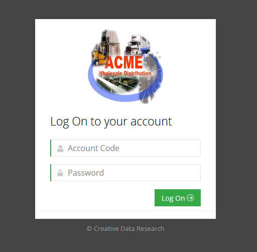
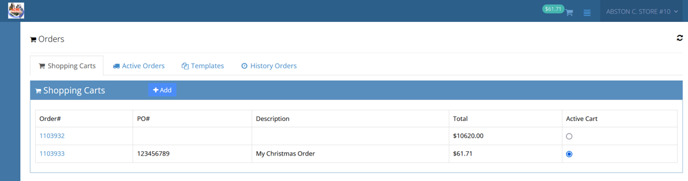
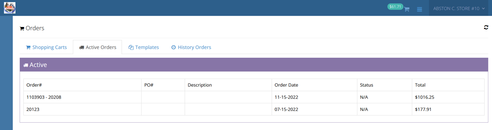
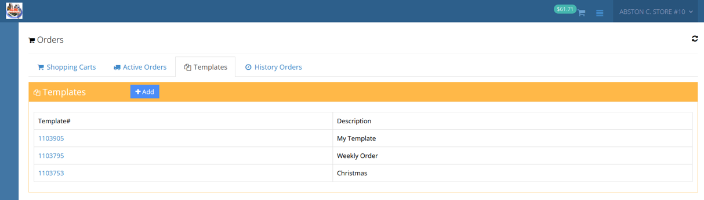
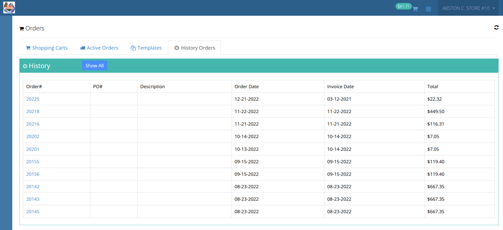
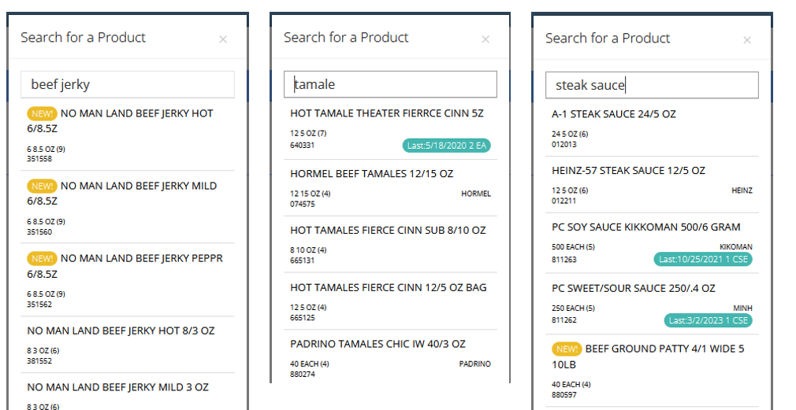

# DAC Portal Ecommerce System User Guide

## Overview

Welcome to the DAC Portal Ecommerce System! This guide provides a high-level overview of the system's functionality.

## Introduction

DAC Portal enables retail customers to efficiently manage their orders in real-time using their mobile smart devices or desktop computers. This eliminates the need for specialized order entry devices and scanners, allowing distributors to leverage their existing hardware. The system supports Bluetooth scanning, enabling users to scan shelf tags, product barcodes, and perform tasks traditionally associated with dedicated hardware order entry systems.

## Features

### Universal Accessibility

DAC Portal is accessible using any device with an internet connection and a web browser.  There is no app to install.

### Hardware and OS Independent

DAC Portal eliminates the need to purchase and manage expensive, dedicated hardware for your customers.  Retailers can use DAC Portal from the device of their choice, such as an Android phone or tablet, iPhone, iPad, Surface, and Mac or Windows desktop systems.

### Consistent, Modern User Experience

DAC Portal is independent of device form-factor.  Retailers have the same experience using the system while walking the floor with a mobile phone or tablet as they do sitting in the back office.

### Flexible Scanning Options

DAC Portal is specifically designed with mobile barcode scanning in mind.  Retailers can choose from a wide variety of inexpensive Bluetooth devices which turn any smart phone or tablet into a portable barcode scanner. Scanning is optional.   DAC Portal can be used without a scanner, allowing the user to hand-key the item number or UPC.  It also provides a convenient product search feature.

### Images

DAC Portal supports the display of product images during the ordering process, helping retailers visually confirm items as they build orders. Images enhance the user experience across all device types, whether on mobile or desktop.

To enable this feature, product images must be uploaded to the following directory on your web server:
/html/webcon/dacPortal/images

Each image file should be named using the 6-digit item number of the product it represents and saved as a .JPG (000006.jpg, 123456.jpg). This naming convention ensures that the portal can correctly associate and display the image with the corresponding item.

Once uploaded, images will automatically appear throughout the DAC Portal, providing visual context that improves speed and accuracy when placing or reviewing orders.

## Getting Started

### 1. Logging In

To access DAC Portal, log in using your customer account code and password.

### 2. Tabs Overview

- **Shopping Cart Tab:** Create new orders.
  
- **Active Orders Tab:** View submitted orders and check their status.
  
- **Templates Tab:** Manage template orders for creating new orders.
 
- **History Tab:** View filled and invoiced orders.
 

### 3. Creating a New Order

1. Navigate to the **Shopping Cart Tab.**
2. Click **Add** to create a new order.
3. Review and adjust order options (optional).
4. Click **Create.**
5. The system will place you on the **Edit Page** for the new order.

### 4. Adding Products to the Order

- **Scanning:** Use a Bluetooth scanner to scan product UPC codes or shelf tags.
- **Search:** Click **Search,** enter a few letters of the product description, and select the product from the list. The search option leverages keyword tagging and relevence.

### 5. Submitting an Order

1. After adding products, click **Submit Order.**
2. Confirm the action.
3. View the submitted order on the **Active Orders Tab.**

## System Compatibility

DAC Portal features responsive web design, ensuring compatibility with any device that has a web browser. The system dynamically adjusts its user interface for various devices, including landscape or portrait orientation on iPhones, iPads, Android devices, and more.
