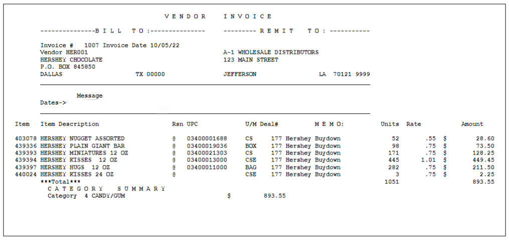
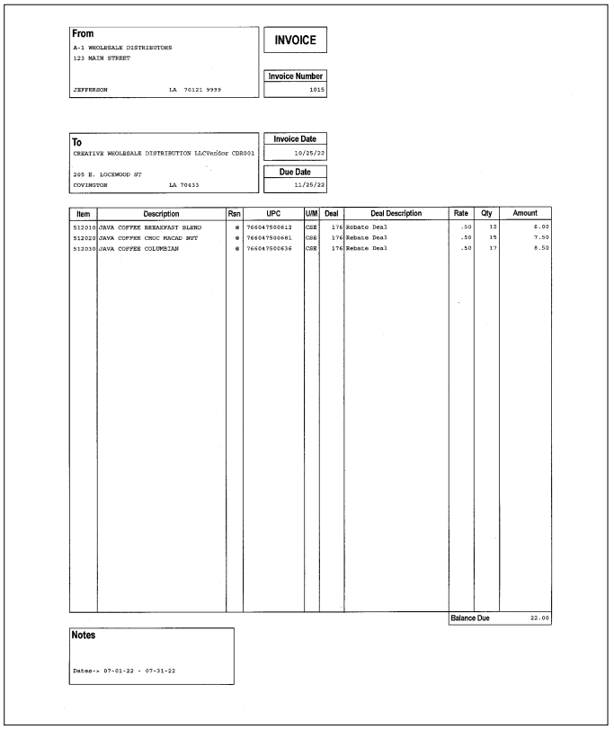

# Vendor Billing

## Working With Vendor Billing

The Vendor Billing applications are primarily used to create invoices. Typically the transactional amounts accumulated by vendor deals are “imported” by vendor billing users who later “export” the invoiced amounts to Vendor Receivables for tracking and processing. Refer to the [Vendor Receivables document](&lt;../user-guide/Vendor Receivables.md&gt;) for additional information.

To begin working with Vendor Billing, select option 10 (Vendor Receivables) from the Purchasing screen. The Vendor Relations screen appears.

To open the Vendor Billing screen, select option 2 (Vendor Billing) from the Vendor Relations screen.

### Editing The Vendor Receivable Address Book

The Work With Address Book application is used to add the distributor’s “remit to” address for the vendor billing invoices and alternative vendor addresses if needed.

1. Select option 10 (Vendor Receivables) from the Purchasing screen. The Vendor Relations screen appears.
2. Select option 2 (Vendor Billing) from the Vendor Relations screen. The Vendor Billing screen appears.
3. Select option 3 (Work With Address Book) from the Vendor Billing screen. The Work with VR Address Book screen appears.
4. Press &lt;F10&gt; (Add New Entry). The Edit VR Address Entry Details screen appears.
5. Enter data for the following:
   - **Name** (35 characters, alpha) - company name of the distributor or vendor.
   - **Address Line 1** (30a) - first line of the mailing address.
   - **Address Line 2** (30a) - second line of the address.
   - **Address Line 3** (30a) - third line of the address.
   - **City** (25a) - city of the mailing address.
   - **State** (2a) - state abbreviation of the address.
   - **Zip Code** (5n) - zip code of the address.
   - **Zip Ext** (5n) - 4-digit extension of the address.
6. Enter REMIT for the **Address Type** (6a) field if adding the distributor’s address.
7. Enter the vendor code for the **Master Vendor**(6a) field if adding an alternative vendor's address. If necessary, press &lt;F4&gt; to select a vendor code from the Select Vendor Master Screen.
8. Press &lt;F3&gt; when data entry is complete. The Work With VR Address Book screen appears.

### Adding An Invoice By Importing Vendor Deal Data

The instructions below describe using the Build Vendor Invoice application to create vendor billing invoices by importing data accumulated for vendor deals.

1. Select option 10 (Vendor Receivables) from the Purchasing screen. The Vendor Relations screen appears.
2. Select option 2 (Vendor Billing) from the Vendor Relations screen. The Vendor Billing screen appears.
3. To open the Build Vendor Invoice screen either select:
   - Option 2 (Build Vendor Invoice) from the Vendor Billing screen or
   - Option 1 (Work With Vendor Invoices) and press &lt;F10&gt; (Create Invoice) when the Work With Vendor Invoices screen appears.
4. Enter data for the following fields:
   - *Optional*: Vender # (6a) - the vendor code. If necessary press &lt;F4&gt; to select a vendor code from the Select Vendor Master screen.
   - *Optional*: Invoice Date (6n) - the invoice date.
   - *Optional*: Terms (3a) - a terms code. If necessary press &lt;F4&gt; to select a terms code from the Select Terms Description screen.
   - *Optional*: Due Date (6n) - the due date.
   - Import Deal # Activity (6n) - a vendor deal number. If necessary press &lt;F4&gt; to select a deal number from the Select Deal screen. The This is a mixed vendor deal. A separate invoice will created for each vendor message appears when a mixed vendor deal is selected.
   - Import Item Level Details for Deal? (1a) - Y (yes) to import item level information or N (no) to create a single line summary of the deal activity.
   - Include Items with Zero Accrual $ ? (1a) - Y (yes) to import item level information for items with no accumulated amounts.
   - *Optional*: Start Date and End Date (6n) - dates to limit the invoice to amounts accumulated during a designated date range.
5. Press &lt;Enter&gt; when data entry is complete.
6. Press &lt;F10&gt; (Create Invoice) and press &lt;Enter&gt; to confirm. The Edit Vendor Invoice screen appears if a single invoice is created.
7. Enter data for the following fields:
   - *Optional*: M E S S A G E S (35,A) - text which will print at the bottom of the invoice.
   - *Optional*: Terms (3,a) - a terms code.
   - *Optional*: Due Date (6,n) - the due date.
8. To edit the bill to address, either:
    - Press &lt;F4&gt; (Search for Alternate Billing Address) an select it from the Select Address Book Entry screen, or
    - Press &lt;F8&gt; (Unlock Address) and enter the address.
9. Press &lt;Enter&gt; when data entry is complete. The VR Invoice screen appears.
10. Press &lt;F3&gt; (Exit). The Work With Vendor Invoices screen appears

### Adding A Vendor Billing Invoice Manually

The instructions below describe using the Build Vendor Invoice application to create a vendor billing invoice by entering the data manually.

1. Select option 10 (Vendor Receivables) from the Purchasing screen. The Vendor Relations screen appears.
2. Select option 2 (Vendor Billing) from the Vendor Relations screen. The Vendor Billing screen appears.
3. To open the Build Vendor Invoice screen either select:
   - Option 2 (Build Vendor Invoice) from the Vendor Billing screen or
   - Option 1 (Work With Vendor Invoices) and press &lt;F10&gt; (Create Invoice) when the Work With Vendor Invoices screen appears.
4. Enter data for the following fields:
   - Vendor # (6a) - the vendor code. If necessary press &lt;F4&gt; to select a vendor code from the Select Vendor Master screen.
   - Optional: Invoice Date (6n) - the invoice date.
   - Optional: Terms (3a) - a terms code. If necessary press &lt;F4&gt; to select a terms code from the Select Terms Description screen.
   - Optional: Due Date (6n) - the due date.
5. Press &lt;Enter&gt; when data entry is complete.
6. Press &lt;F10&gt; (Create Invoice) and press &lt;Enter&gt; when prompted to confirm.
7. Enter data for the following fields:
   - *Optional*: M E S S A G E S (35,A) - text which will print at the bottom of the invoice.
   - *Optional*: Terms (3,a) - a terms code.
   - *Optional*: Due Date (6,n) - the due date.
8. To edit the bill to address, either:
    - Press &lt;F4&gt; (Search for Alternate Billing Address) an select it from the Select Address Book Entry screen, or
    - Press &lt;F8&gt; (Unlock Address) and enter the address.
9. Press &lt;F10&gt; (Create Invoice) and press &lt;ENTER&gt;  when prompted to confirm. The VR Invoice screen appears.
10. Enter data for the following fields for the invoice item:
    - **Rsn** (2,a) - reason code. If necessary, press &lt;F4&gt;  to select a code from the Select VR Transaction Reason screen.
    - **Qty** (5,n) - quantity of the item.
    - **Amount** (9.2,n) - rate or unit price of the item.
    - Optional: **Line Description** (25,n) - text describing the item.
11. Press &lt;ENTER&gt;  when data entry is complete. The G/L Account Entries screen appears.
12. If necessary, enter data for the following fields:
    - **Company** (3,a) - a company code.
    - **Debit Cost Center** (3+4,n) - a cost center number.
    - **Debit Account** (5+4,n) - a G/L account number.
    - **Credit Cost Center** (3+4,n) - a cost center number.
    - **Credit Account** (5+4,n) - a G/L account number.
13. Press &lt;ENTER&gt; when data entry is complete, and press &lt;ENTER&gt; when prompted to confirm. The VR Invoice screen appears.
14. Press &lt;F3&gt; (Exit) when data entry is complete. The Work With Vendor Invoices screen appears.

## Editing A Vendor Billing Invoice

The instructions below describe using the Work With Vendor Invoices application to edit the details and header information of a vendor billing invoice.

When using the Work With Vendor Invoices screen, the following restrictor fields can be used:

- **Vendor#** (6,a) - enter a vendor code and press &lt;Enter&gt; to limit the list to include only the invoices of the desired vendor. If necessary, press &lt;F4&gt; to select a vendor code from the Select Vendor Master screen.
  
- **Invoice** (6,n) - enter an invoice number, press &lt;Field Exit&gt; and press &lt;Enter&gt;. The list is redisplayed beginning with this invoice number.
  
- **Date** (6,n) - enter a date and press &lt;Field Exit&gt; to display only the invoices the date entered.
  
- **Printed** (6,n) - enter a date and press &lt;Field Exit&gt; to display only the invoices printed on the date entered.
  
- **Status** (1,a) - enter O (Open), P (Printed) or X (Exported) and press &lt;Field Exit&gt; to display only the invoices of the status entered.
  
- **Amount** (11.2,n) -enter an amount to display only the invoices with an equal total amount.

1. To edit the invoice details, locate the desired invoice in the screen’s list (use the restrictor fields or &lt;Page Downt&gt; if necessary), and enter 2 (Edit) in the selection column next to the vendor code, and press &lt;Enter&gt;. The VR Invoice screen appears.

    When using the VR Invoice screen, the following restrictor fields can be used:
   - **Line** (5,n) - enter a line number, press &lt;Field Exit&gt; and press &lt;Enter&gt;. The list is redisplayed beginning with this line number.
   - **Item** (6,n) - enter an item number and press &lt;Enter&gt; to limit the list to the item with the number entered. If necessary, press &lt;F4&gt;to select an item from the Select Item screen.

2. To edit an item, locate the desired item in the screen’s list (use the restrictor fields or &lt;Page Down&gt; if necessary), and enter 2 (Edit Line) in the selection column next to the item’s line number, and press &lt;Enter&gt; . The Edit VR Invoice Line Details screen appears.
3. To change the unit of measure of an item, enter a valid value of 1, 2, 3 or 4 for the **Unit of Measure** (1,n) field, and the unit’s description for the **Unit of Measure Text** (3,a) field.
4. To change the vendor deal, enter a valid deal number for the **Deal Number** (6,n) field, and the deal’s description for the **Deal Description** (25,a)Field.
5. To change the VR transaction reason, enter a valid reason code for the **Reason** (2,a) field.  
6. If necessary, enter data for the following fields:
    - **Qty** (5,n) - quantity of the item.
    - **$ Amount** (9.2,n) - rate or unit price of the item.
    - **$ Extension** (11.2,n) - total price of the item.  
7. If necessary, enter data for the following fields:
   - **G/L Company** (3,a) - a company code.
   - **Credit Cost Center** (3+4,n) - a cost center number.
   - **Credit Account** (5+4,n) - a G/L account number.
   - **Debit Cost Center** (3+4,n) - a cost center number.
   - **Debit Account** (5+4,n) - a G/L account number.
8. Press &lt;Enter&gt; when data entry is complete. The VR Invoice screen appears.  
9. To add an item to the invoice, enter data for the following fields:
   - **Rsn** (2,a) - reason code. If necessary, press &lt;F4&gt; to select a code from the Select VR Transaction Reason screen.
   - **Qty** (5,n) - quantity of the item.
   - **Amount** (9.2,n) - rate or unit price of the item.
   - *Optional*: **Line Description** (25,n) - text describing the item.
10. Press &lt;Enter&gt; when data entry is complete. The G/L Account Entries screen appears.
11. If necessary, enter data for the following fields:
    - **Company** (3,a) - a company code.
    - **Debit Cost Center** (3+4,n) - a cost center number.
    - **Debit Account** (5+4,n) - a G/L account number.
    - **Credit Cost Center** (3+4,n) - a cost center number.
    - **Credit Account** (5+4,n) - a G/L account number.
12. Press &lt;Enter&gt; when data entry is complete, and press &lt;Enter&gt; when prompted to confirm. The VR Invoice screen appears.
13. To edit the invoice header information, press &lt;F10&gt; (Header). The Edit Vender Invoice screen appears.
14. If necessary, enter data for the following fields:
    - Optional: **M E S S A G E S** (35,A) - text which will print at the bottom of the invoice.
    - Optional: **Invoice Date** (6,n) - the invoice date.
    - Optional: **Terms Code** (3,a) - a terms code.
    - Optional: **Due Date** (6,n) - the due date.
15. To edit the bill to address, either:
    - Press &lt;F4&gt; (Search for Alternate Billing Address) and select it from the Select Address Book Entry screen, or
    - Press &lt;F8&gt; (Unlock Address) and enter the address.
16. Press &lt;Enter&gt; when data entry is complete, and press &lt;Enter&gt; when prompted to confirm. The VR Invoice screen appear

### Printing Vendor Billing Invoices

The instructions below describe using the Work With Vendor Invoices application to print two versions of the vendor billing invoice. The first version uses a landscape format printed on “plain paper.” Version 2 is printed using the Formless Printing optional DAC module in a portrait format. Examples of both versions are included below. Contact CDR support personnel for additional information about the Formless Printing optional DAC module.

#### Version 1

1. To print version 1 of the invoice locate the desired invoice in the screen’s list (use the restrictor fields or &lt;Page Down&gt; if necessary) and enter P (Print Invoice) in the selection column next to the vendor code and press &lt;Enter&gt;.
2. Enter N (no) and press &lt;Enter&gt; when the Would you like to email this Vendor Invoice? message appears.
3. Enter N (no) and press &lt;Enter&gt; when the Do You Want to Print a Separate Envelope Window Address Page? message appears.

#### Version 2

1. To print version 2 of the invoice, locate the desired invoice in the screen’s list (use the restrictor fields or &lt;Page Down&gt; if necessary), and enter V (InvoiceV2) in the selection column next to the vendor code, and press &lt;Enter&gt;
2. Enter N (no) and press &lt;Enter&gt; when the *Would you like to email this Vendor Invoice?* message appears.
3. Enter N (no) and press &lt;Enter&gt; when the *Do You Want to Print a Separate Envelope Window Address Page?* message appears.

### Exporting Invoice Data To Vendor Receivables

The instructions below describe using the Work With Vendor Invoices application to export invoiced amounts to Vendor Receivables for tracking and processing. Refer to the Vendor Receivables document for information about adding and applying vendor receivable transactions after the invoice data is exported.

When using the Work With Vendor Invoices screen, the following restrictor fields can be used:

- **Vendor#** (6,a) - enter a vendor code and press &lt;Enter&gt; to limit the list to include only the invoices of the desired vendor. If necessary, press &lt;F4&gt; to select a vendor code from the Select Vendor Master screen.

- **Invoice** (6,n) - enter an invoice number, press &lt;Field Exit&gt; and press &lt;Enter&gt;. The list is redisplayed beginning with this invoice number.

- **Date** (6,n) - enter a date and press &lt;Field Exit&gt; to display only the invoices the date entered.

- **Printed** (6,n) - enter a date and press &lt;Field Exit&gt; to display only the invoices printed on the date entered.

- **Status** (1,a) - enter O (Open), P (Printed) or X (Exported) and press &lt;Field Exit&gt; to display only the invoices of the status entered.

- **Amount** (11.2,n) -enter an amount to display only the invoices with an equal total amount.
  
1. After locating the desired invoice in the screen’s list (use the restrictor fields or &lt;Page Down&gt; if necessary), enter X (Export to Receivables) in the selection column next to the vendor code, and press &lt;Enter&gt;.

2. Enter a date when the Enter the Transaction Creation Date message appears, press &lt;Enter&gt; and press &lt;Enter&gt; to confirm. The value of X appears for the status of the exported vendor invoice.
